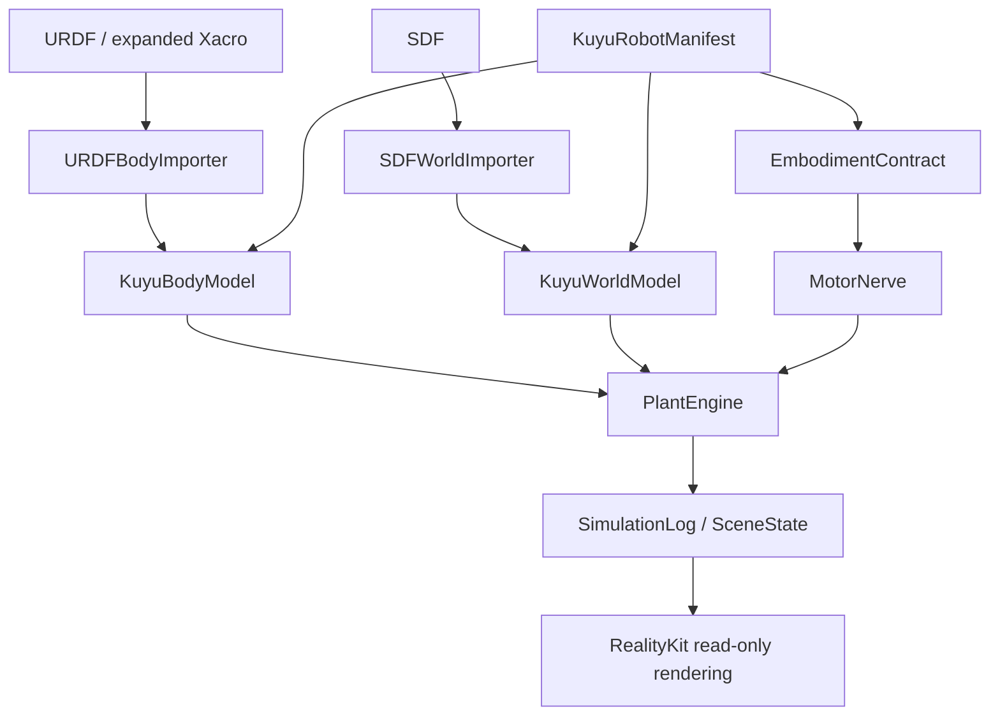

# Body/World Model Design

Kuyu separates robot body, simulated world, and Manas control boundary.

| Contract | Authority | Does not own |
|---|---|---|
| `KuyuBodyModel` | Robot morphology, mass, inertia, joints, geometry, actuator/sensor mounting. | World physics, Manas policy, UI rendering state. |
| `KuyuWorldModel` | Gravity, timestep, solver, surfaces, materials, contact/friction policy. | Robot morphology or control routing. |
| `EmbodimentContract` | Shared Manas/Kuyu signal and MotorNerve boundary. | Plant dynamics or training policy. |
| `KuyuRobotManifest` | Identity and references. | Physical values or algorithms. |
| `CompatibilityReport` | Mapping/provenance/readiness evidence. | Runtime behavior. |

`ReadinessLevel.dynamicSimulation` is the current RoArm M1 target. Contact-rich
training and hardware parity are separate gates and must fail until explicitly
supported.
