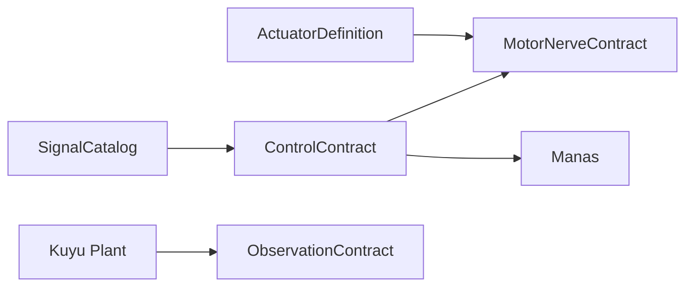

# Embodiment Contract

`EmbodimentContract` is the neutral control boundary shared by Kuyu and Manas.
It contains signal declarations, actuator/sensor limits, latency budgets, and
MotorNerve routing. It does not contain plant physics, world configuration, UI
state, or learning algorithms.

| Part | Responsibility |
|---|---|
| `SignalCatalog` | Typed sensor, actuator, drive, reflex, descending, summary channels. |
| `SensorDefinition` | Sensor channels, rate, latency, noise/dropout/swap profiles. |
| `ActuatorDefinition` | Actuator limits and dynamic response. |
| `ControlContract` | Drive/reflex/descending/summary channel order and latency budgets. |
| `MotorNerveContract` | Deterministic morphology-dependent routing to actuator values. |

Manas may consume this contract. It must not bypass MotorNerve or plant safety
boundaries.
