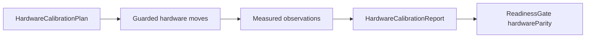

# Hardware Parity

Hardware parity is an evidence gate. It is not satisfied by URDF, SDF, STL,
STEP, manufacturer torque sheets, or Kuyu supplemented values alone.

| Contract | Role |
|---|---|
| `HardwareCalibrationPlan` | Safe sweep commands and required observation fields. |
| `HardwareCalibrationReport` | Measured response, identified dynamics, and optional contact evidence. |
| `ReadinessGate` | Fails closed unless every active joint has measured evidence within tolerance. |

The report must cover active joints, actuator IDs, command directions,
mechanical reductions, measured joint positions, latency, time constant,
deadband, backlash, viscous damping, Coulomb friction, mean absolute error, and
max observed error. `hardwareParity` uses a strict position tolerance cap of
0.05 rad. A report may choose a tighter tolerance; it cannot relax the cap.

Contact-rich grasp training is a separate evidence problem. It needs calibrated
contact pair measurements such as normal force, tangential force, slip velocity,
penetration, material friction, stiffness, and damping for the actual end
effector and object class.
