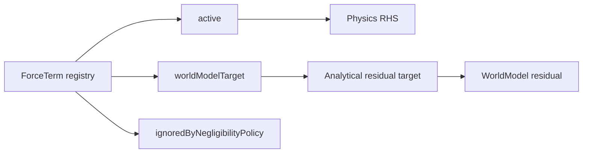

# Kuyu パッケージ再構成計画 — 融合環境設計

## 前提: Physics と WorldModel の明確な境界

### 境界 = 正準力項レジストリの分割

物理シミュレーションは正準力項レジストリから `ẋ = f(x, u)` を組み立てる。
**active に含まれる項**が解析物理の領域。**worldModelTarget に含まれる項**が
世界モデルの residual 学習領域。**ignoredByNegligibilityPolicy に含まれる項**が
許容以下として落とす領域である。境界はモデル種別ではなく、同じ項集合の分割で決まる。

#### 具体例: クアッドロータ

**物理モデル（ODE）の内部:**

```
ẋ = f(x, u) where:
  x = [position(3), velocity(3), orientation(4), angular_velocity(3)]  = 13 dim
  u = [motor_commands(4)]

  f includes:
    ├── Newton-Euler: F=ma, τ=Iα
    ├── Motor model: thrust = k·ω², torque = b·ω²
    ├── Gravity: F_g = mg
    ├── Linear drag: F_d = -c_d·v·|v|
    └── Gyroscopic: τ_gyro = Σ(ω_prop × J_prop·ω_prop)
```

→ これらは物理が**必ず**計算する。精度は高く、コストは低い。
→ 世界モデルが代替する意味はない。

**物理モデル（ODE）の外部:**

```
物理の f が知らないもの:
  ├── 地面効果: ΔF = f(h/R) where h=高度, R=ローター半径
  │     → h < 2R で揚力が最大30%増加。解析解はあるが非線形で環境依存
  ├── プロップウォッシュ: 隣接プロペラの気流が他に干渉
  │     → N²の相互作用。解析的にはBoussinesq近似が必要
  ├── モーター個体差: k_real ≠ k_nominal
  │     → 温度・摩耗・製造誤差。パラメータ同定が必要
  ├── バッテリー電圧降下: V(t) = V₀ - I·R_internal - f(SoC)
  │     → 非線形。残量依存。電気化学モデルが必要
  ├── 突風・乱流: F_wind(t, x) — 確率過程
  │     → Dryden/Von Karman モデルは統計的のみ。実際の風は非定常
  ├── ペイロード動力学: 吊り下げ物の振動
  │     → 追加の自由度。振り子モデルを f に追加する選択肢はあるが複雑化
  ├── 壁面効果: 近接する壁からの反射気流
  │     → 境界条件付き流体力学。事実上CFDが必要
  └── センサードリフト: バイアスが温度・時間で変化
        → 統計モデルはあるが実データなしでは不正確
```

→ これらが世界モデルの領域。物理的に不可能なのではなく、**実用的にモデル化のコストが合わない**。

#### 境界の性質

**境界は離散的**: ある現象は f に入っているか入っていないか。中間はない。

**境界は選択可能**: より精緻な fidelity view（fₐ ⊂ f_b）を使えば境界は外側に広がる。
- 簡素モデル: 剛体 + 重力のみ → 世界モデルが多くを担う
- 標準モデル: + モーター + ドラッグ → 世界モデルは残差と環境を担う
- 精密モデル: + 接触 + 弾性 + CFD → 世界モデルは個体差と環境のみ

**境界は設計時に決まる**: 実行時にαで調整するのではなく、
どの fidelity partition を使うかを選んだ時点で境界が決まる。



---

## 設計: 物理の骨格 + 世界モデルの肉付け

### 合成アーキテクチャ（加算ではなく合成）

```
┌─────────────────────────────────────┐
│ AnalyticalModel（物理の骨格）          │
│                                      │
│ 入力: state, action                  │
│ 出力: predicted_state                │
│                                      │
│ 計算: ODE ẋ = f(x, u) を積分         │
│ 保証: f のパラメータが正確なら正確     │
│ コスト: O(1) per step                │
└──────────────┬──────────────────────┘
               │ physics_prediction
               │ （これは骨格。変えない。そのまま保存される。）
               ↓
┌─────────────────────────────────────┐
│ WorldModel（学習された肉付け）         │
│                                      │
│ 入力: physics_prediction,            │
│       sensor_observations,           │
│       action_history                 │
│                                      │
│ 出力:                                │
│   residual — RHS へ戻せる補正          │
│     （モーター劣化 → Δthrust）        │
│     （未モデル化ドラッグ → ΔF）        │
│   extension — 物理にない状態次元       │
│     （環境コンテキスト z_env）          │
│     （不確実性推定 σ）                 │
│     （適応ベクトル z_adapt）           │
│                                      │
│ 保証: データなし → residual=0         │
│       データあり → 物理を改善          │
│ コスト: モデルサイズに依存              │
└──────────────┬──────────────────────┘
               │
               ↓
┌─────────────────────────────────────┐
│ FusedState（融合状態）                 │
│                                      │
│ physics:   [pos, vel, quat, ω, ...]  │ ← 物理がそのまま提供
│ residual:  [Δthrust, ΔF, Δτ, ...]   │ ← 世界モデルの力/トルク補正
│ extension: [z_env, σ, z_adapt, ...]  │ ← 世界モデルの拡張
│                                      │
│ ※ physics は変更されない              │
│ ※ residual の正準形は RHS に入る力/トルク空間 │
│ ※ 既存の state-space residual は互換ビュー │
│ ※ extension は新しい次元              │
└─────────────────────────────────────┘
```

**世界モデルが未訓練のとき:**
- residual = 0（補正なし）
- extension = 0（拡張なし）
- FusedState ≈ physics_prediction（既存Kuyuと同一）

**世界モデルが訓練済みのとき:**
- residual ≠ 0（物理モデルの誤差を学習から補正）
- extension ≠ 0（物理にない情報を追加）
- FusedState > physics_prediction（物理を超える状態推定）

### シミュレーション時 vs 実機時

**シミュレーション時（Kuyu内）:**
```
physics_prediction = ground_truth（シムが真値を提供）
residual ≈ 0（物理モデル = シミュレータ、同一なので誤差なし）
extension = learned（環境コンテキスト等を学習可能）

→ 世界モデルは主に extension を学習する場
→ Domain Randomization で residual の学習準備も可能
```

**実機時:**
```
physics_prediction = model_estimate（解析モデルの予測）
residual = learned_correction（sim-to-real gap を含む）
extension = inferred（センサーパターンから推定）

→ residual が sim-to-real gap を吸収する
→ extension が未観測環境変数を推定する
```

**訓練パイプライン:**
```
Phase 1: Physics-only
  Kuyu物理シムで Manas を BC warm-start
  世界モデルなし（residual=0, extension=0）

Phase 2: Extension 学習
  物理シムのロールアウトから z_env, z_adapt を学習
  StateTokenizer + TransitionModel を訓練
  ロス: reconstruction + KL

Phase 3: Residual 学習（Domain Randomization）
  物理パラメータをランダム化（質量±20%, モーターゲイン±30%等）
  世界モデルに「パラメータ変動 → 動作変化」のパターンを学習させる
  → 実機でのモデル不一致に対する事前準備

Phase 4: 実機適応
  少量の実機データ（10-50エピソード）で residual を fine-tune
  DomainAdapter または LoRA で sim_z → real_z マッピング
  physics_prediction はそのまま。補正のみ更新。

Phase 5: Imagination RL
  WorldPredictor で将来をロールアウト
  physics prior があるので imagination が安定
  Actor-Critic で policy を改善
```

---

## Manas ascending/descending との対応

### FusedState → ascending channels

```
FusedState の3層が自然にManasのascending channel type に対応:

Type S: Raw sensor channels [ChannelSample]
  ← SensorField.sample() の出力。生のセンサー値。
  ← 物理の内外に関わらず、観測可能な全てのセンサーデータ。

Type P: Physics prediction channels [Float]
  ← AnalyticalModel.predict() の出力。
  ← 物理が計算した状態の予測値。
  ← ODE の解そのもの。

Type R: Residual channels [Float]
  ← WorldModel の residual 出力。
  ← 物理予測への学習済み補正。

Type E: Extension channels [Float]
  ← WorldModel の extension 出力。
  ← 環境コンテキスト、適応ベクトル、不確実性。
  ← 物理にない次元の情報。

全て shared_encoder（type_embedding で区別）→ Core（L4）が統一処理。

重要: ascending channel の N が可変であることは、
物理モデルの選択（= 境界の位置）に応じて
Type P の次元数が変わることを自然に吸収する。
```

### 物理モデルの選択 = 境界の選択 = チャネル構成の選択

```
簡素モデル選択時:
  Type P: [pos(3), vel(3), quat(4), ω(3)] = 13ch
  Type R: [Δthrust(4), ΔF(3), Δτ(3)] = 10ch  (多くの補正が必要)
  Type E: [z_env(8), z_adapt(8), σ(4)] = 20ch

精密モデル選択時:
  Type P: [pos(3), vel(3), quat(4), ω(3), contact(6), aero(3)] = 22ch
  Type R: [Δmotor(4)] = 4ch  (少ない補正で済む)
  Type E: [z_env(4), σ(2)] = 6ch
```

Manas の shared_encoder は N の変化を吸収。
境界の選択がアーキテクチャ変更を要求しない。

---

## Cosmos コンセプトの転写

| Cosmos | 本設計 | 境界との関係 |
|---|---|---|
| Tokenizer | `StateTokenizer` | physics + sensor の系列を潜在圧縮 |
| Predict | `TransitionModel` | physics prediction を prior とした遷移予測 |
| Transfer | `DomainAdapter` | sim_residual → real_residual のマッピング |
| Policy (Injection) | ascending Type R/E | 世界モデル出力がチャネルとして注入 |

### StateTokenizer — 時系列の潜在圧縮

```
入力: [batch, time_steps, raw_channels]
  raw_channels = physics_state + sensor_readings + action
  = [13 + 6 + 4] = 23ch（簡素モデルの場合）

1D Causal Conv Stack:
  Conv1d(in → hidden, kernel=3, causal)  × N layers
  stride > 1 で時間方向圧縮

出力: [batch, compressed_steps, latent_dim]

用途:
  - TransitionModel への入力（時系列パターンの凝縮）
  - AdaptationModule の発展形（固定長z → 可変長トークン列）
  - Decoder で元のチャネルに復元可能（reconstruction loss で訓練）
```

### TransitionModel — Physics-Informed 遷移

```
入力:
  h_{t-1}: 確定的状態 [batch, h_dim]
  a_{t-1}: アクション [batch, action_dim]
  φ_phys:  PhysicsEncoder(physics_prediction) [batch, phys_embed_dim]
           ← 物理の予測を埋め込んだもの。これが physics-informed の核心。

GRU:
  h_t = GRU(concat(h_{t-1}, a_{t-1}, φ_phys), h_{t-1})

Prior（物理 informed）:
  z_prior = CategoricalHead(h_t)

Posterior（センサーで補正、訓練時のみ）:
  z_post = CategoricalHead(concat(h_t, φ_obs))

出力:
  residual = ResidualDecoder(h_t, z_post)   ← 物理予測への補正
  extension = ExtensionDecoder(h_t, z_post)  ← 物理にない次元

KL loss: D_KL(posterior || prior)
  → 物理予測が正確なら prior ≈ posterior（KL ≈ 0）
  → 物理予測が不正確なら posterior が observation で補正（KL > 0）
  → KL が自動的に「物理の不正確さ」を測定する
```

### DomainAdapter — sim residual → real residual

```
シミュレーション時:
  residual_sim ≈ 0（物理モデル = シミュレータ）
  extension_sim = learned context

実機時:
  residual_real ≠ 0（モデル不一致）
  extension_real = real context

DomainAdapter:
  (residual_real, extension_real) = Adapt(residual_sim, extension_sim, real_data)

方式:
  - 少量実データで fine-tune（LoRA or full）
  - OT alignment（sim分布 → real分布のマッピング）
  - RWML（embedding distance reward で RL 訓練）
```

---

## パッケージ構成

```
unconscious/
├── manas/                     （既存・変更なし）
│
├── kuyu-core/                 （NEW — 環境の抽象定義）
│   ├── KuyuCore               （ゼロ依存）
│   │   ├── AnalyticalModel protocol（物理モデルの抽象）
│   │   ├── WorldModel protocol（学習モデルの抽象）
│   │   ├── FusedEnvironment<A, W>（合成環境）
│   │   ├── FusedState（physics + residual + extension）
│   │   ├── 既存プロトコル（PlantEngine, SensorField, etc.）
│   │   ├── 既存型（DriveIntent, ActuatorValue, ChannelSample, etc.）
│   │   └── WorldSimulator（後方互換）
│   └── KuyuRuntime            （swift-log, swift-configuration）
│
├── kuyu-physics/              （NEW — 解析的モデル実装）
│   └── KuyuPhysics            depends: kuyu-core/KuyuCore
│       ├── QuadrotorAnalyticalModel: AnalyticalModel
│       │   └── ODE: 剛体6DOF + モーター + ドラッグ + 重力
│       ├── 具象 Plant/Sensor/Actuator 実装（~65ファイル）
│       └── IdentityWorldModel（residual=0, extension=0 のスタブ）
│
├── kuyu-world-model/          （NEW — 学習モデル実装）
│   └── KuyuWorldModel         depends: kuyu-core/KuyuCore, mlx-swift
│       ├── StateTokenizer     （1D causal conv encoder/decoder）
│       ├── TransitionModel    （physics-informed GRU + categorical）
│       ├── ResidualDecoder    （h, z → residual corrections）
│       ├── ExtensionDecoder   （h, z → latent extensions）
│       ├── WorldPredictor     （将来ステップのロールアウト）
│       ├── DomainAdapter      （sim → real マッピング）
│       ├── PhysicsEncoder     （physics_state → φ_phys 埋め込み）
│       ├── WorldModelConfig   （Codable 構成）
│       └── WorldModelState    （推論時内部状態）
│
├── kuyu-scenarios/            （NEW — シナリオ・評価）
│   └── KuyuScenarios          depends: kuyu-core, kuyu-physics
│
├── kuyu-training/             （NEW — 訓練パイプライン）
│   └── KuyuTraining           depends: kuyu-core, kuyu-scenarios
│
├── kuyu/                      （既存 — アプリケーション層）
│   ├── KuyuMLX                （FusedEnvironment 構成 + Manas ブリッジ）
│   ├── KuyuUI
│   └── KuyuCLI
│   depends: 全 kuyu-* + manas
│
└── bounded/
```

## 核心プロトコル（KuyuCore）

```swift
/// 解析的モデル。ODE ẋ = f(x, u) を解く。
/// 境界は f の定義域で決まる。f に含まれないものは計算しない。
public protocol AnalyticalModel: Sendable {
    associatedtype State: AnalyticalState

    /// ODE を1ステップ積分
    mutating func predict(action: [ActuatorValue], dt: TimeInterval) throws -> State

    /// 現在の解析的状態
    var currentState: State { get }
}

/// 解析的状態。物理モデルが計算する全変数を含む。
public protocol AnalyticalState: Sendable {
    /// 状態の次元数（物理モデルの選択で変わる）
    var dimensions: Int { get }

    /// Float 配列として取得
    func toArray() -> [Float]

    /// デバッグ用のスナップショット
    func toPlantStateSnapshot() -> PlantStateSnapshot
}

/// 世界モデル。物理モデルの予測を受け取り、補正と拡張を出力する。
/// 物理予測は変更しない。その上に情報を追加する。
public protocol WorldModel: Sendable {
    /// 物理予測 + センサー観測から、補正と拡張を計算
    mutating func infer(
        physicsPrediction: any AnalyticalState,
        sensorObservations: [ChannelSample],
        action: [ActuatorValue],
        dt: TimeInterval
    ) throws -> WorldModelOutput

    /// 将来を予測（imagination 用）
    mutating func predictFuture(
        steps: Int,
        actions: [[ActuatorValue]]
    ) throws -> [WorldModelOutput]

    mutating func reset() throws
}

/// 世界モデルの出力。物理を変更せず、補正と拡張を提供する。
public struct WorldModelOutput: Sendable {
    /// 物理予測への補正（同じ次元空間）
    /// residual[i] は physics_state[i] への加算的補正
    /// 未訓練時は全て 0
    public let residual: [Float]

    /// 物理にない追加次元（環境コンテキスト、適応状態、不確実性）
    /// 次元数は WorldModel の設計で決まる
    public let extensions: [Float]

    /// 不確実性推定（residual + extensions の各次元の信頼度）
    public let uncertainty: [Float]
}

/// 融合状態。物理 + 補正 + 拡張の合成。
/// physics はそのまま保存される。混合しない。
public struct FusedState<S: AnalyticalState>: Sendable {
    /// 物理モデルの予測（変更されない）
    public let physics: S

    /// 世界モデルの出力
    public let worldModelOutput: WorldModelOutput

    /// 補正済み物理状態（= physics + residual）
    /// コントローラへの ascending Type P + R チャネル用
    public var correctedState: [Float] {
        zip(physics.toArray(), worldModelOutput.residual).map { $0 + $1 }
    }

    /// 拡張状態（物理にない次元）
    /// コントローラへの ascending Type E チャネル用
    public var extensionState: [Float] {
        worldModelOutput.extensions
    }
}

/// 融合環境。AnalyticalModel と WorldModel を合成する。
public struct FusedEnvironment<A: AnalyticalModel, W: WorldModel>: Sendable {
    public var analyticalModel: A
    public var worldModel: W
    public var sensorField: any SensorField

    public mutating func step(
        action: [ActuatorValue], dt: TimeInterval
    ) throws -> FusedState<A.State> {
        // 1. 物理が計算（ODE 積分）
        let physicsState = try analyticalModel.predict(action: action, dt: dt)

        // 2. センサーがサンプリング
        let observations = try sensorField.sample(...)

        // 3. 世界モデルが補正 + 拡張（物理予測を入力として受け取る）
        let wmOutput = try worldModel.infer(
            physicsPrediction: physicsState,
            sensorObservations: observations,
            action: action,
            dt: dt
        )

        // 4. 融合状態を構成（物理はそのまま保存）
        return FusedState(physics: physicsState, worldModelOutput: wmOutput)
    }
}
```

**IdentityWorldModel（物理のみ）:**
```swift
/// 世界モデルなし。residual=0, extensions=空。既存 Kuyu と同一。
public struct IdentityWorldModel: WorldModel {
    public mutating func infer(...) throws -> WorldModelOutput {
        WorldModelOutput(residual: Array(repeating: 0, count: dims), extensions: [], uncertainty: [])
    }
}
```

## 依存グラフ

```
KuyuCore (ゼロ依存)
  ├── AnalyticalModel, WorldModel protocols
  ├── FusedEnvironment<A, W>, FusedState<S>
  ├── WorldModelOutput (residual + extensions + uncertainty)
  └── 既存型
    ↑                  ↑
KuyuPhysics            KuyuWorldModel (mlx-swift)
(AnalyticalModel impl)  (WorldModel impl)
    ↑                        ↑
KuyuScenarios                |
    ↑                        |
KuyuTraining                 |
    ↑                        |
    +----------+-------------+
               |
       KuyuMLX (FusedEnvironment<Quadrotor, StateWorldModel>)
               |
       +-------+-------+
       |               |
     KuyuUI          KuyuCLI
```

## 実装順序

### Phase 1: kuyu-core 抽出 + プロトコル定義
1. kuyu-core/ + Package.swift 作成
2. 既存 KuyuCore から swift-log 依存除去 → KuyuRuntime
3. AnalyticalModel, WorldModel プロトコル追加
4. FusedEnvironment<A,W>, FusedState<S>, WorldModelOutput 追加
5. IdentityWorldModel 追加（kuyu-core 内。MLX 不要。）
6. ビルド確認

### Phase 2: kuyu-physics 抽出
1. KuyuProfiles の物理実装 ~65 ファイルを移動
2. QuadrotorAnalyticalModel: AnalyticalModel アダプタ作成
3. ビルド確認

### Phase 3: kuyu-scenarios + kuyu-training 抽出
1. Scenario/ → kuyu-scenarios、Training/ → kuyu-training
2. KuyuProfiles ターゲット削除
3. ビルド確認

### Phase 4: kuyu-world-model（MLX 実装）
1. PhysicsEncoder（physics_state → φ_phys 埋め込み）
2. StateTokenizer（1D causal conv encoder/decoder）
3. TransitionModel（physics-informed GRU + categorical）
4. ResidualDecoder, ExtensionDecoder
5. WorldPredictor（imagination 用ロールアウト）
6. DomainAdapter（スタブ → 実機データで訓練）
7. WorldModelConfig（Codable）
8. 単体テスト

### Phase 5: 融合統合
1. KuyuMLX で FusedEnvironment<QuadrotorAnalyticalModel, StateWorldModel> 構成
2. FusedState → Manas ascending channels（Type S/P/R/E）マッピング
3. IdentityWorldModel で既存結果と完全一致を確認
4. StateWorldModel で residual + extensions が動作することを確認
5. 訓練パイプライン: Physics-only → Extension → Residual(DR) → Real adapt → Imagination

## 検証

```bash
# 個別
cd kuyu-core && swift build && swift test
cd kuyu-physics && swift build && swift test
cd kuyu-world-model && swift build && swift test

# 融合
# 1. IdentityWorldModel: FusedState.correctedState == physics_state（residual=0）
# 2. StateWorldModel(untrained): residual ≈ 0（ランダム初期化だが小さい）
# 3. StateWorldModel(trained on DR): 物理パラメータ変動時に residual が補正
# 4. KL divergence: physics が正確なら KL ≈ 0、不正確なら KL > 0
```

## 重要な制約

- KuyuCore: ゼロ依存
- **物理予測は変更されない**。WorldModel は residual と extensions を提供するのみ
- IdentityWorldModel で residual=0, extensions=空 → 既存 Kuyu と数値同一
- KuyuPhysics ↔ KuyuWorldModel: 相互依存なし
- 境界は ODE の定義域で決まる。実行時の混合比パラメータではない
- 物理モデルの選択（簡素/標準/精密）で境界が移動する → チャネル数が変わる → Manas が吸収
