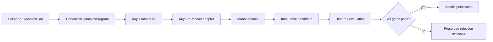
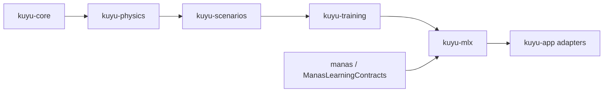
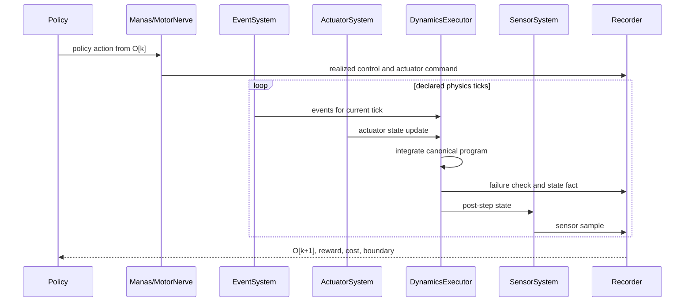
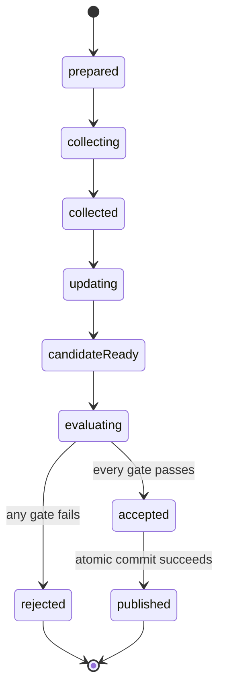

# Kuyu Learning System Specification

Status: normative target architecture. The current implementation is not
conforming until every migration gate in this document passes.

This specification intentionally permits source, package, artifact, and
checkpoint compatibility breaks. Compatibility MUST NOT preserve ambiguous
ownership or mathematically invalid training behavior.

## 1. Objective

The golden path is one observable, reproducible state machine that can:

1. execute a scenario against canonical Kuyu physics,
2. collect causally complete learning evidence,
3. update a Manas candidate with a mathematically defined optimizer,
4. evaluate the reloaded candidate on held-out scenarios,
5. accept or reject it through typed gates, and
6. publish an accepted checkpoint atomically with its evidence.

A run that only writes files, changes weights, or completes without an error is
not evidence that learning works. A conforming qualification run MUST produce a
reloadable candidate that improves the declared task-quality metric without
violating the declared safety non-regression gates.



## 2. Authority and Package Ownership

There MUST be one authority for each semantic fact.

| Semantic fact | Authority | Consumers |
|---|---|---|
| IDs, deterministic time, artifact primitives | `kuyu-core` | All Kuyu packages |
| State layout, force terms, constraints, integrator, fidelity partition | `kuyu-physics` | Scalar and accelerated world executors |
| Task intent, reset, stress schedule, reward, cost, failure, task quality | `kuyu-scenarios` | Training runtime and evaluators |
| Persisted rollout schema, validation, lifecycle, gates, evidence | `kuyu-training` | Backends, CLI, UI |
| MLX graph compilation, policy distribution, optimizer, checkpoint adapter | `kuyu-mlx` | Kuyu training runtime |
| Control protocol, model structure, optimizer-ready in-memory inputs | `manas` | Manas trainers and Kuyu adapters |
| Commands and read-only presentation | `kuyu-app` / Bounded | Operators |

The dependency direction is:



`manas-training-data` MUST be removed. Manas MUST NOT own a persisted copy of a
Kuyu dataset schema or read Kuyu artifact directories. `ManasLearningContracts`
is an in-package Manas target containing only optimizer-ready, in-memory sample
and batch contracts. `KuyuManasMLXAdapter` validates Kuyu artifacts and converts
them into those contracts.

No package below `kuyu-mlx` may import MLX or Manas MLX modules. No Manas target
may import Kuyu scenario, reward, failure, or artifact types.

## 3. Canonical World Program

### 3.1 Single definition

Every plant family MUST expose one typed `CanonicalDynamicsProgram`. It defines:

- canonical state and parameter layouts,
- actuator dynamics,
- force and torque terms,
- constraints and post-step projection,
- fixed-step integration stages including every normalization/projection point,
- derived physical observables used by sensors,
- fidelity partitions, and
- a stable program digest.

Force terms expressed only as opaque Swift closures are not a portable canonical
definition. The program MUST use a closed, versioned, backend-independent opcode
set whose operations, shapes, units, and differentiability are validated when
the program is built. An arbitrary Swift closure cannot enter canonical mode.
Scenario scheduling, policy cadence, and reward/failure semantics do not belong
inside this graph; they remain in `ScenarioExecutionPlan`.

Two executors consume the same program:

| Executor | Responsibility | Prohibited responsibility |
|---|---|---|
| `ScalarDynamicsExecutor` | Deterministic `Double` execution and reference traces | Redefining terms or scenario support |
| `MLXDynamicsExecutor` | Compile and cache a batched MLX graph by program digest | Maintaining independent equations |

The existing reference-quadrotor force-term IDs, fidelity partitions, state,
parameters, and canonical integrator semantics should be retained. Closure-backed
`AnyQuadrotorForceTerm` evaluation and tensor-world-local equations are replaced
by the canonical operation graph and its two executors. `SinglePropPlantEngine`
becomes either a logic-free facade over the reference program's `.singleProp`
fidelity or is removed.

Execution identity MUST include program schema/version/digest, fidelity,
constraint projection, mixer and rotor-spin convention, executor version,
numeric dtype, and device class. Scalar `Double` and MLX `Float` parity uses a
declared per-output absolute/relative tolerance and boundary classification
rule; matching configuration names or hashes alone is not proof of parity.

### 3.2 Scenario execution plan

`kuyu-scenarios` MUST compile every scenario definition into a validated
`ScenarioExecutionPlan`. The plan contains:

- scenario identity and revision,
- required plant family and dynamics-program constraints,
- initial state and reset policy,
- stress/event schedule,
- observation and action-space descriptors,
- policy, CUT, MotorNerve, and sensor cadence plus held-command policy,
- reward and safety-cost descriptors,
- failure and truncation policies,
- task-quality evaluator identity, and
- required backend capabilities.

Scalar and accelerated backends MUST query this plan. They MUST NOT maintain
separate scenario-kind allowlists. Backend selection is explicit, validated
before reset, and recorded in every artifact. Unsupported capability is a typed
error; implicit fallback to another physics implementation is prohibited.

### 3.3 Control interval semantics

Reset emits `O[k]` at simulation time `t[k]`. One environment decision advances
exactly one declared control interval:



The fixed per-tick order is:

1. apply events scheduled for the current tick,
2. update actuator dynamics from the held command,
3. execute one canonical integration step,
4. project constraints and validate finite state,
5. evaluate fail-fast conditions,
6. sample sensors from the resulting state, and
7. append tick evidence.

Reward and safety cost are aggregated over completed ticks. The interval stops
at the first failure tick. `actualDuration` and `physicsTickCount` record the
short interval. The next control decision is never evaluated after failure.

## 4. Persisted Learning Contract: KuyuDataset v7

### 4.1 One persisted schema

`KuyuDataset` schema version 7 is the only schema accepted by runtime training.
Versions 3 through 6 are legacy inspection inputs and may be read only by an
explicit offline migrator. Runtime loaders MUST reject them and MUST NOT perform
implicit conversion.

Legacy migration returns a typed result:

- `migrated`: every fact required by the target record kind is present and
  validated,
- `downgradedToOffPolicy`: the causal transition is complete but exact behavior
  policy evidence is unavailable, or
- `rejected(missingFacts:)`: the target relation cannot be established.

Migration MUST NOT synthesize policy context, distribution parameters,
pre-transform samples, log probability, action-source observations, outcome
observations, actuator commands, or boundaries. Existing v6 records produced by
the clipped sampling path cannot become `onPolicyTransition`; they may become
off-policy data only when the remaining causal facts validate. Every migration
writes a report containing source digest, target digest, result, and lost-use
classification.

The artifact remains streamable as `manifest.json` plus `records.jsonl`. The
manifest declares one record kind. Every JSONL record is a tagged envelope whose
payload type must match the manifest.

| Record kind | Required semantic relation | Consumer |
|---|---|---|
| `demonstration` | `O[label] -> A[teacher]` | Supervised actor training |
| `onPolicyTransition` | `O[k], A[k], E[behavior] -> O[k+1]` | PPO / constrained PPO |
| `offPolicyTransition` | `O[k], A[k] -> O[k+1]` | Replay-based algorithms and analysis |
| `worldTransition` | `X[k], U[actuator], events -> X[k+1]` | World-model residual training |

The current optional-field aggregate `TrainingDatasetRecord` MUST be replaced by
these purpose-specific payloads. A record kind cannot represent an incomplete
sample by setting required facts to `nil`.

### 4.2 Manifest identity

The v7 manifest MUST contain:

- dataset, producer, scenario, suite, seed, episode, and segment identities,
- code, configuration, embodiment, and canonical dynamics-program digests,
- execution backend ID/version, numeric dtype/device class, fidelity,
  constraint-projection ID, and mixer/rotor-spin convention,
- observation-space, policy-action-space, realized-control-space, and actuator-
  command-space descriptors with stable digests,
- reward, safety-cost, failure, and task-quality descriptor digests,
- nominal physics step and control-period tick count,
- behavior policy/checkpoint identity when applicable, and
- record count plus content digest.

Plain string action encodings are insufficient. Space descriptors MUST define
channel IDs, order, units, bounds, transform, and version. A digest mismatch is
a typed validation failure.

### 4.3 Causal transition

Every control transition MUST preserve all of the following as distinct facts:

| Fact | Meaning |
|---|---|
| `sourceObservation` | Exact observation used for the policy decision |
| `sourceStateFacts` | Scenario/world facts required to encode the source critic input |
| `policyAction` | Value in the declared policy action space |
| `realizedControl` | DriveIntent and bounded Reflex result after control processing |
| `actuatorCommand` | Morphology-dependent command applied to actuator dynamics |
| `outcomeObservation` | Observation after the completed interval |
| `outcomeStateFacts` | Scenario/world facts required to encode the outcome critic input |
| `reward` / `safetyCost` | Scenario-owned aggregates over the interval |
| `interval` | Start/end time, actual duration, and completed physics ticks |
| `boundary` | Explicit continuation, terminal, truncation, or segment-end fact |

Observation, policy action, realized control, and actuator command MUST NOT be
collapsed into one untyped vector. Conversion between spaces is explicit and
identified by the responsible component. A privileged critic does not authorize
Manas to reinterpret missing world state: the manifest declares the critic-state
fact descriptor and the Kuyu artifact stores both source and outcome facts.

### 4.4 Trajectory identity and boundaries

Array order, `done == false`, and directory order never imply trajectory
continuity. Each transition has an episode ID, segment ID, segment index,
transition index, and decision ID.

The boundary is one of:

- `continues`: next transition is in the same validated segment,
- `terminal`: task success or fail-fast terminal reason; no bootstrap,
- `truncated`: declared reason and explicit bootstrap permission,
- `segmentEnd`: no trace continuation; an optional bootstrap observation may be
  used only for the final temporal-difference target.

Cross-segment stitching requires a matching typed continuation token and is
performed by a dedicated `TrajectoryAssembler` before batching. Generic batch
coalescing MUST reset recurrent history and GAE traces at each segment boundary.
Bootstrap permission and trace continuation are separate typed values.

GAE and critic targets are computed over validated whole trajectory segments
before minibatch partitioning. `OnPolicyTrajectoryBatch` contains source and
outcome critic inputs, segment offsets, policy context, rewards/costs, and typed
boundaries. A bootstrapable truncation or segment end uses
`V(outcomeObservation)`; it MUST NOT use `V(sourceObservation)` as a self
bootstrap. Trace continuation is zero at every segment boundary. Dataset order
and minibatch size MUST NOT change returns or advantages.

### 4.5 Policy execution context

The manifest declares one `PolicyContextContract`. It is exactly one of:

- `fixedHistory`: a bounded history length, feature order, padding/reset rule,
  and previous-action rule. Rollout and training rebuild the same window; a
  persistent hidden state that changes action semantics is prohibited.
- `recurrent`: a recurrent-state space digest, reset rule, segment-initial state,
  burn-in prefix, burn-in count, and loss mask. Rollout and training unroll from
  the same initial state. Behavior evidence records action-time input/output
  recurrent-state digests so replay divergence fails closed.

The context mode cannot change within a dataset. A recurrent segment that starts
mid-episode without a validated initial state is not on-policy training data.
Burn-in records update recurrent state but do not contribute policy/value loss or
GAE until the loss mask becomes active.

### 4.6 On-policy evidence

`OnPolicyTransition` MUST contain `BehaviorPolicyEvidence` captured in the same
forward pass that produced the action. It contains:

- policy/checkpoint and distribution contract digests,
- distribution kind and version,
- base mean and log standard deviation,
- pre-transform sample,
- transformed bounded action, and
- exact behavior log probability in the transformed action space.

The selected algorithm contract also declares whether behavior reward-value and
cost-value predictions are required for value clipping or audit. When required,
they are captured from the collection checkpoint and are not recomputed after an
optimizer update.

PPO input is an `OnPolicyTrajectoryBatch`; its initializer requires behavior
evidence. Public `requireBehaviorStatistics` switches and fallbacks that
recompute old log probability from the current model MUST be removed.
Advantages, returns, and old-policy facts are calculated once against the
collection checkpoint before the first optimizer epoch and are reused unchanged
for all minibatches/epochs derived from that trajectory.

### 4.7 Streaming and atomic commit

The v7 reader decodes JSONL incrementally, maintains bounded memory, and verifies
record count and rolling content digest while consuming the stream. Reading the
entire records file into a `String` is prohibited for runtime datasets.

The writer stages artifacts in a unique directory on the destination filesystem:

1. stream records while calculating count and digest,
2. close and synchronize the records file,
3. write the manifest last with the final count/digest,
4. reload and validate the staged artifact,
5. synchronize staged files and directory metadata, and
6. atomically rename the completed directory into place.

The manifest is the completion marker. A partial directory is never published as
a dataset. Cleanup, destination collision, digest mismatch, interrupted write,
and atomic-rename failure are typed outcomes.

## 5. Policy Distribution Contract

A policy distribution owns sampling, deterministic action selection, bounds,
entropy, and log-probability evaluation. Those operations MUST share one
parameterization and one forward-pass result.

For bounded continuous PPO actions, the default is an invertible squashed
Gaussian with an affine mapping to each channel's declared bounds. The behavior
log probability MUST include the transform Jacobian. Adding Gaussian noise to
an already transformed mean and then clipping is not a valid PPO distribution.

`clampedLinear` is prohibited for stochastic on-policy training unless an exact
truncated or censored distribution, including boundary mass, is implemented and
versioned. It may remain for deterministic inference only when the action-space
descriptor declares that mode.

Checkpoint compatibility MUST include the action-space digest and distribution
contract digest. A policy whose distribution contract changes is a new policy
revision even when tensor shapes are unchanged.

## 6. Optimizer Input Boundary

The Kuyu-to-Manas adapter performs this sequence:

1. load and validate a current Kuyu artifact,
2. assemble explicitly linked trajectories,
3. encode Kuyu observations into the declared Manas model input,
4. convert typed policy evidence and targets into `ManasLearningContracts`, and
5. deliver immutable in-memory batches to the trainer.

The adapter MUST fail before tensor creation when identity, space, boundary,
terminal, cost, behavior, or provenance facts required by the selected
algorithm are missing.

`ManasLearningContracts` MUST NOT contain filesystem URLs, JSON coding logic,
scenario enums, reward descriptors, or Kuyu terminal reasons. It may contain
validated tensors/buffers, masks, policy evidence, target values, and stable
source identity needed for audit.

Manas MUST NOT recompute, relabel, or default a scenario reward or safety cost.
`DenseRewardConfig`, `DenseRewardComputer`, and persisted-dataset inputs are
removed from the Manas batch boundary. The adapter supplies validated reward,
cost, outcome critic input, boundaries, segment offsets, context/burn-in data,
and loss masks.

## 7. Learning and Publication State Machine

`LearningCampaignOrchestrator` MUST expose one persisted state machine:



Every transition writes an immutable event with run ID, parent checkpoint ID,
candidate ID, timestamps, input/output artifact references, and typed reason.
Cancellation and failure are explicit terminal outcomes, not aliases for
rejection or success.

A candidate cannot become the next parent until all gates pass:

1. dataset and checkpoint artifact validity,
2. deterministic checkpoint reload and inference equivalence,
3. held-out task-quality improvement above the declared minimum delta,
4. safety-cost and failure-rate non-regression,
5. required scenario/suite coverage,
6. determinism and provenance evidence, and
7. atomic publication durability.

Optimizer state, reward critic, cost critic, dual variables, adaptive curriculum
state, and parent selection move together. Rejection restores the complete
parent state; retaining candidate-side adaptive state is prohibited.

Publication writes immutable candidate artifacts first, validates them from
disk, then atomically updates the campaign head. A partially written checkpoint
or an in-memory-only evaluation cannot be published.

Final promotion evidence MUST include deterministic replay on the authoritative
scalar executor. Accelerated evaluation may screen candidates, but it cannot be
the sole source of task-quality, failure, or safety acceptance.

## 8. Operator Observability Contract

The runtime, not the UI, produces a `LearningCampaignProgressSnapshot` read
model. The operator model has three explicit levels:

```text
campaign progress and performance
  -> active scenario evaluations
       -> active control-step execution
```

It contains:

- current lifecycle stage and blocking reason,
- morphology/embodiment and scenario-suite coverage,
- completed episodes, updates, generations, throughput, and ETA confidence,
- every active scenario and control-step work unit with typed
  run/iteration/generation/candidate/batch scope, phase, state, scenario
  suite/identity/seed, completed count, total count, and population size,
- parent, current candidate, and accepted-best task quality,
- success rate, reward, safety cost, and failure rate by generation and scenario,
- pending and completed gate results, and
- indexed failure/replay references.

The first operator view presents campaign progress and comparative performance.
Selecting a failure opens its deterministic replay, causal transition facts,
and copyable error/gate details. Replay is a diagnostic drill-down, not the
default campaign overview.

The stable work identity is the seed plus the complete typed scope, phase, unit
kind, and unit identifier. A child completion MUST remove only that child; it
MUST NOT clear a still-running parent or a concurrently running sibling. A
terminal campaign state MUST clear every active scenario and control-step view.
Candidate acceptance uses the same reporting path with phase `candidateGate`;
it MUST NOT become an unobservable second evaluation path.

The runtime MUST persist a work-start event before entering each expensive
scenario or optimization unit and a work-completed event after it returns.
Persistence precedes live UI publication and persistence failure fails the run
closed. `latestWorkProgress` is historical evidence; active arrays contain only
unfinished work under a non-terminal campaign. The UI MUST NOT label completed
or superseded work as currently running.

A control-step unit counts policy decisions. Its transition records separately
retain the exact number of enclosed physics ticks. Progress emission MUST use a
fixed event budget per work unit, independent of the scenario horizon, and MUST
align updates with completed accelerator synchronization boundaries. Started and
terminal events are always emitted; intermediate events are bounded.

Campaign ETA is derived from completed candidate evaluations. Scenario ETA is
derived from the selected active control-step history. They are separate
estimates with separate confidence and MUST NOT be substituted for one another.
Producer event time, observer receipt time, and artifact-load time are separate
freshness signals so a responsive UI cannot disguise a stalled worker.

Progress journals are append-only, attempt-bound streams. Readers MUST retain a
byte cursor and decode only newly appended complete records. A partial trailing
record is held until completion; malformed complete records, identity mismatch,
or sequence discontinuity fail closed. File replacement or truncation resets the
cursor only after attempt identity is revalidated. Repainting the UI MUST NOT
reload and decode the full journal.

Artifact discovery and indexing MUST run off the main actor and publish bounded
snapshots. Menus consume lightweight precomputed identities; opening a menu MUST
NOT scan directories or decode training bundles. UI layout MUST reserve stable
space for status and errors so a message cannot resize the seek bar or primary
controls. All errors and identifiers must support text selection and copy.

## 9. Verification Contract

### 9.1 Contract tests

The following are release-blocking:

| Contract | Required proof |
|---|---|
| Schema | Every producer output is accepted by every declared consumer validator |
| Dynamics | Scalar and MLX executors consume the same program digest and match integration stages, derived observables, and boundaries within declared tolerances |
| Scenario | One execution plan yields identical reset, event, reward, cost, failure, and support semantics across backends |
| Trajectory | Dataset reordering/coalescing cannot cross episode or segment boundaries |
| Distribution | Sample/log-probability round trip, Jacobian, bounds, and saturation stress are numerically verified |
| PPO | Missing or mismatched behavior evidence cannot construct an on-policy batch |
| PPO identity | An unchanged collection checkpoint yields likelihood ratio approximately one before any update |
| Recurrent context | Rollout/replay action likelihood and hidden-state digests agree after reset, burn-in, and segment resume |
| GAE | Returns and advantages are invariant to dataset ordering and minibatch partition; bootstrap uses the outcome state |
| Artifact I/O | Incremental read, digest corruption, interrupted staging, and atomic publication cases fail closed |
| Publication | Reloaded bytes reproduce evaluated inference and atomic head update |
| UI read model | Snapshot generation is independent of SwiftUI and artifact indexing is not main-actor work |

Source-text and source-shape assertions are prohibited as substitutes for these
behavior contracts.

### 9.2 Golden learning qualification

At least one deterministic short reference campaign MUST prove the complete
path with production APIs. It must:

- collect non-empty current-schema on-policy trajectories,
- reproduce rollout actions and likelihoods from the persisted policy context,
- execute at least one real optimizer update with finite gradients,
- produce a candidate whose parameters differ from the parent,
- reload the candidate from its published artifact format,
- reproduce evaluation inference within tolerance,
- exceed the declared held-out task-quality improvement threshold,
- satisfy safety and failure-rate gates, and
- reach `published` through the same state machine used by CLI and UI.

A pipeline smoke test and a learning qualification are separate tests. The
qualification may not replace the trainer, evaluator, gate, or persistence path
with a test-only implementation.

All Xcode test invocations MUST have a timeout. CI MUST inspect the result bundle
and fail when the selected test count is zero. Long campaigns use a dedicated
scheme; the focused qualification remains bounded enough for regular CI.

## 10. Destructive Migration

No dual runtime truth is permitted. Migration proceeds in this order:

1. Add boundary tests and freeze new v6 producers.
2. Implement the complete foundation before switching a producer:
   purpose-specific v7 records, staging I/O, typed migration results,
   `PolicyContextContract`, the exact `PolicyDistribution`,
   `TrajectoryAssembler`, and `ManasLearningContracts`.
3. Replace Manas persisted-dataset/reward reconstruction APIs and implement the
   v7-to-Manas adapter plus whole-trajectory GAE/PPO input path.
4. Switch scalar producers, validators, adapters, and trainers to v7 in one
   migration wave. Runtime training rejects legacy schemas at that switch.
5. Introduce `CanonicalDynamicsProgram` and the scalar executor; establish
   scalar conformance traces and stable execution identity.
6. Compile that program in the MLX executor, establish parity, then switch tensor
   producers to v7 and delete tensor-local equations and scenario allowlists.
7. Convert `KuyuMLXWorldModel` and the current `manas-cosmos-adapter` to v7.
   External dataset conversion is a Kuyu import responsibility, so the Cosmos
   adapter becomes a Kuyu-owned adapter and emits v7 with explicit provenance.
8. Delete `manas-training-data`, its persisted schema, loaders, and package edges.
9. Route training, evaluation, acceptance, rollback, and publication through
    the single persisted lifecycle state machine.
10. Replace source-shape and self-bootstrap tests with contract, parity,
    likelihood-ratio, GAE-invariance, and golden learning tests.
11. Switch UI/CLI to the runtime progress read model, then remove compatibility
    initializers, deprecated readers, and obsolete fields.

These are implementation steps within one non-released migration branch. A
release MUST NOT expose a mixed v6/v7 training runtime. `RolloutBuffer`,
`OnlineDataBuffer`, and record budgeters may operate on off-policy records or
whole segments only; they MUST NOT split/reorder on-policy trajectories before
advantage computation.

Each step is complete only when its behavior tests pass and downstream packages
no longer import the replaced API. Deprecations may exist within one migration
step, but the final conforming branch contains no runtime v3-v6 reader, no
`ManasTrainingDataset`, no tensor-local canonical equations, and no PPO fallback
that fabricates behavior evidence.

## 11. Conformance Gates

| Gate | Exit condition |
|---|---|
| G0 Ownership | Dependency and import tests enforce the authority table |
| G1 Artifact | v7 round trip, migration, corruption, and producer-consumer tests pass |
| G2 World | Scalar/MLX program digest and parity suites pass for every supported scenario capability |
| G3 Optimizer | Distribution, trajectory, GAE, PPO, and constrained-PPO tests pass |
| G4 Golden path | Deterministic reference campaign publishes an improved reloadable checkpoint |
| G5 Observability | CLI and UI show the same lifecycle snapshot and failure evidence without blocking the main actor |

Until G4 passes, the project may claim that training code executes, but MUST NOT
claim that end-to-end learning is operational. Until G5 passes, it may not claim
that learning progress is operationally observable.
