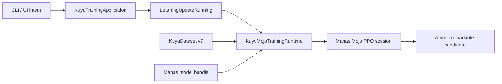

# Kuyu Mojo Cutover Record

Status: source and application cutover complete; platform qualification remains.

This record captures the current implementation state. Normative behavior is in
`SPEC.md` and `LEARNING_SYSTEM_SPEC.md`; package ownership is in
`../KUYU_PACKAGE_ARCHITECTURE.md`.

## Implemented Production Path

The source graph contains one numerical backend. The former backend package,
aliases, resources, application imports, application-level campaign hierarchy,
and unused learned world-model implementation were deleted. Backend-neutral
campaign and worker contracts remain reusable infrastructure; they do not form
the active bounded application path. No compatibility facade or fallback was
retained.

The bounded training update performs these operations:

1. verify the source bundle identity and every KuyuDataset v7 record;
2. verify recurrent segment, action-space, behavior-distribution, transform,
   and policy/checkpoint identity evidence, including equality between the
   dataset checkpoint digest and the pinned source-bundle SHA-256;
3. enforce transition and scalar budgets before materialization;
4. initialize a Mojo-owned model and optimizer session;
5. execute Core forward, reward/cost GAE, clipped PPO, recurrent BPTT, global
   gradient clipping, and Adam;
6. snapshot the complete updated model and optimizer state;
7. atomically publish a new candidate directory; and
8. reload the complete bundle through the production Manas loader before
   returning success.

Cancellation before step 7 leaves no candidate. Once atomic publication begins,
it is the commit point and the operation reports the committed result.

## Ownership and Lifetime

| Resource | Creator | Owner | Lifetime | Failure contract |
|---|---|---|---|---|
| Learning request | CLI/UI request factory | Application coordinator | One update | Invalid paths and plans fail before execution |
| Dataset snapshot | KuyuDataset reader | Training service | One update | Digest, schema, causal, and budget violations are typed failures |
| Model/optimizer state | Mojo session factory | Mojo session | Session | Complete Adam/Lagrange state resumes from a candidate; base bundles initialize explicitly; no backend fallback |
| Swift payload buffer | Manas Mojo adapter | One synchronous call | Borrow scope | Contiguous Float32 payload; pointer does not escape |
| Mojo workspace | Mojo session | Mojo session | Session | Bounded allocation and transactional optimizer commit |
| Candidate staging directory | Candidate writer | Writer | Publication attempt | Removed on failure; final destination is never overwritten |
| Published candidate | Artifact store | Immutable bundle | Persisted revision | Success requires production-loader reload |

## Performance Decision

The current Manas controller has 69,323 trainable parameters. For the bounded
recurrent update, CPU SIMD avoids accelerator launch, synchronization, and
host/device transfer overhead. The measured M4 Max update for 32 transitions is
2.65–2.93 ms, below the declared 10 ms update budget.

This is a shape-aware decision, not a platform abstraction claim. Mojo does not
make Apple and NVIDIA devices identical. `swift-mojo` binds every compiled
artifact to a target triple, architecture, runtime closure, and digest. An
accelerator-resident session will be added only if a larger measured workload
fails the CPU budget.

## Remaining Qualification

| Gate | Exit condition | State |
|---|---|---|
| Mac functional | Real dataset produces a complete reloadable candidate | Implemented; bounded fixture passes |
| Mac performance | Repeated production updates, peak memory, and sustained thermal evidence meet declared budgets | Open |
| Golden learning | Reloaded candidate improves held-out task quality without safety regression | Open |
| Jetson runtime | Native artifact load, inference parity, latency, memory/power, cancellation, shutdown, and HIL safety pass | Open |

Jetson is the execution target, not the baseline optimizer host. Native Jetson
qualification must use its target artifact and runtime evidence; a macOS result
or cross-compiled object is not accepted as Jetson execution proof.
