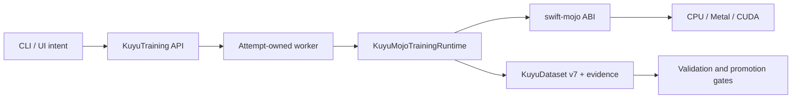
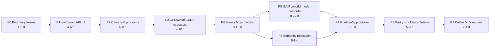
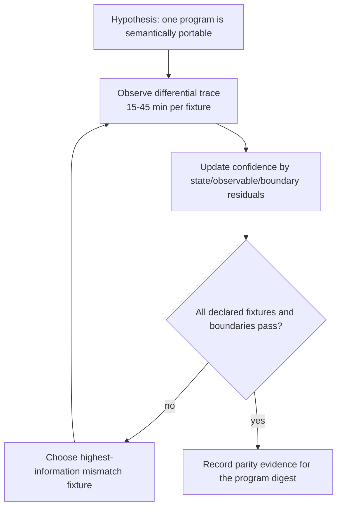

# Kuyu Mojo Migration Ledger

Status: active, non-released destructive migration.

This ledger records implementation state. Normative behavior remains in
`SPEC.md` and `LEARNING_SYSTEM_SPEC.md`; package ownership remains in
`../KUYU_PACKAGE_ARCHITECTURE.md`.

## Completion Claim

Kuyu is not Mojo-backed end to end yet. The current application and training
runtime still execute through `kuyu-mlx`. KuyuPhysics owns the closed canonical
dynamics program and Swift Float64 reference, while `kuyu-mojo` now compiles and
executes the same digest-bound program with a real Mojo 1.0 CPU Float64 backend.
The CPU executor has passed differential force, derivative, observable, RK4,
zero-boundary, projection, typed-failure, and strict 400-step/s gates. Its C ABI
is also packaged as a verified aarch64 Linux ELF archive, but that is not native
Jetson execution evidence. This is not a Kuyu Mojo training runtime or proof of
accelerator execution. Metal, CUDA, native Jetson Swift/CUDA, learning
qualification, sanitizer, and hardware-in-the-loop gates remain unverified
until recorded here.

## Final Usage Contract

The conforming application depends on a backend-neutral training API. Backend
selection is explicit deployment configuration, not a runtime fallback chain.

```swift
let request = try TrainingRunRequest(project: project, plan: plan)
let executor: any TrainingRunExecuting = try KuyuRuntimeFactory.mojo(
    deployment: deployment,
    capabilities: requiredCapabilities
)
let handle = try await executor.start(request)
```

The application never imports a concrete accelerator module. A worker receives
an immutable request and checkpoint snapshot, creates one Mojo session, owns its
device buffers for the attempt lifetime, and publishes only validated Kuyu
artifacts.



## Confirmed Current Facts

| Fact | Evidence | Consequence |
|---|---|---|
| The application directly consumes `KuyuMLX` | `../kuyu-app/Package.swift` and `../kuyu-app/Sources` imports | App cutover is blocked until a backend-neutral runtime facade exists |
| The backend package exposes fourteen MLX products | `../kuyu-mlx/Package.swift` | Migration must classify semantic ownership before moving code |
| The reference quadrotor force, derivative, and observable equations are closed SSA operation graphs with validated layouts, shapes, units, differentiability propagation, fidelity partitions, integration stages, and a stable digest | `../kuyu-physics/Sources/KuyuPhysics/Canonical`, `../kuyu-physics/Sources/KuyuPhysics/Plant/ReferenceQuadrotorCanonicalProgram.swift` | The Swift Float64 path is the semantic reference consumed by Plant and IMU; Mojo executors must consume this program rather than copy equations |
| The canonical integrator selects the declared integration scheme and evaluates graph-derived RK4 derivatives; RK4 stage arithmetic remains the Swift Float64 reference implementation | `../kuyu-physics/Sources/KuyuPhysics/Plant/ReferenceQuadrotorCanonicalIntegrator.swift` | P3 must match every declared projection stage and the reference trace before accelerator promotion |
| `swift-mojo` proves scoped Float32 and Float64 borrowed calls, synchronous session, and session-owned host Float32-buffer lifecycle with exact-count synchronous host copies on universal macOS; it also cross-generates a schema-5 aarch64 Linux static artifact bundle and rejects archives that omit the compiled ELF object | `swift-mojo` commits `9382a34` and `4f3f2e7`, `docs/ADR-0007-OPAQUE-RUNTIME-SESSION-ABI.md`, `docs/ADR-0008-NON-APPLE-STATIC-LIBRARY-ARTIFACTS.md`, and `docs/ADR-0009-FLOAT64-BORROWED-BUFFER-ABI.md` | CPU Float64 canonical execution can use a scoped no-escape bridge; native Jetson link/run and MAX-backed Metal/CUDA allocation/synchronization still precede Kuyu cutover |
| `kuyu-mojo` executes all closed canonical opcodes through one generic Mojo SSA interpreter without copied quadrotor equations or a reference fallback | `kuyu-mojo` commit `f4a7fb2`, `PARITY_CONTRACT.md`, and `RELIABILITY_EVIDENCE.md` | The macOS arm64 CPU Float64 rung is implemented and qualified for the fixed reference digest; its Linux ARM64 ABI artifact is cross-verified, while accelerator rungs remain unavailable rather than silently selecting CPU |
| Manas exposes MLX-specific model/runtime/training products | `../manas/Package.swift` | Manas model structure must gain a portable Mojo implementation without moving model ownership into Kuyu |

## Source Ownership Migration

| Current source target | Final owner | Action |
|---|---|---|
| `KuyuMLXCore` | `swift-mojo` and `KuyuMojoCore` | Move generic ABI/ownership/artifact logic upstream; keep only Kuyu capability and session composition downstream |
| `KuyuManasMLXAdapter` | `manas` and `KuyuManasMojoAdapter` | Keep Manas model/bundle structure in Manas; keep Kuyu v7 conversion and model-store gates in the adapter |
| `KuyuMLXEvolution` | `KuyuMojoEvolution` | Port mutation, crossover, inference, and scoring compute behind `kuyu-training` protocols |
| `KuyuMLXReinforcement` | `KuyuMojoReinforcement` | Port policy distributions and optimizer kernels without reconstructing scenario semantics |
| `KuyuMLXWorldModel` | `KuyuMojoWorldModel` | Port compute only; authoritative physics remains in `kuyu-physics` |
| `KuyuMLXCampaignContracts` | `kuyu-training` | Move generic campaign contracts; do not create backend-prefixed replacements |
| `KuyuMLXCampaignValidation` | `kuyu-training` | Move generic artifact and gate validation |
| `KuyuMLXCampaignRuntime` | `kuyu-training` plus `KuyuMojoTrainingRuntime` | Separate lifecycle semantics from concrete compute composition |
| `KuyuMLXReferenceQuadrotor` | `kuyu-physics`, `kuyu-scenarios`, `kuyu-training`, and `kuyu-mojo` | Move equations/scenario meaning/contracts to their authorities; port only compute execution |
| `KuyuMLXRoArmM1` | `kuyu-physics`, `kuyu-scenarios`, `kuyu-training`, and `kuyu-mojo` | Apply the same split through descriptor-driven robot boundaries |
| `KuyuMLXTrainingRuntime` | backend-neutral runtime facade plus `KuyuMojoTrainingRuntime` | Preserve one lifecycle path while replacing its compute implementation |
| `KuyuMLX` | none | Delete after app cutover; do not ship a compatibility facade |
| `KuyuMLXTrainingProbe` | test and diagnostic targets | Remove from the production public API |

## Ownership and Lifetime Contract

| Resource | Creator | Owner | Lifetime | Isolation and failure contract |
|---|---|---|---|---|
| Training request | CLI/UI adapter | Kuyu runtime | One submitted run | Immutable and digest-bound; invalid input fails before worker launch |
| Attempt context | Worker service | Worker actor | One attempt | Ordered lifecycle transitions; cancellation is explicit |
| Checkpoint snapshot | Launcher | Attempt context | One attempt | Read-only and digest-verified; mutable sharing across workers is prohibited |
| Mojo ABI session | `KuyuMojoCore` | Attempt context | Worker attempt | Explicit `shutdown`; capability mismatch is a typed failure |
| Prepared executable artifact | `swift-mojo` | ABI session | Session or verified cache lease | Target triple and digest must match; no path-only trust |
| Device buffers | Mojo session | Mojo session | Bounded operation/session scope | Owner-retained views only; pointers do not escape their borrow scope |
| Canonical world program | `kuyu-physics` | Immutable value | Program revision | Closed opcodes and validated layouts; stable digest identifies semantics |
| Scenario execution plan | `kuyu-scenarios` | Immutable value | Scenario revision | Backends consume one plan; unsupported capabilities fail closed |
| Progress journal | Training runtime | Attempt artifact store | Durable attempt history | Monotonic, attempt-bound, synchronized before live publication |
| Accepted model bundle | Manas publisher | Immutable artifact store | Published revision | Reloaded bytes must reproduce evaluated inference before atomic promotion |

## Implementation Gates and Critical Path

The estimates are engineering time ranges, not elapsed promises. P1 through P8
form the critical path because each establishes a contract consumed by the next
stage. Semantic relocation in P6 can overlap late P4/P5 after its destination
contracts are frozen.



| Gate | Deliverable | Exit condition | State |
|---|---|---|---|
| P0 | Authority freeze and migration ledger | Specs agree; legacy callable gaps are marked or removed; no new MLX production features | Complete |
| P1 | `swift-mojo` ABI v2 | Owned buffers/state, scoped borrows, typed capabilities, shutdown, Linux ARM64 artifact verification | In progress: scoped Float32/Float64 borrows, session/resource ownership, exact-count synchronous host transfer, host Float32-buffer lifecycle, and Linux ARM64 cross packaging are verified; native Jetson link/run and MAX-backed Metal/CUDA allocation/synchronization remain |
| P2 | Canonical dynamics and sensor programs | Closed opcodes, layouts, units, differentiability, integration/projection stages, stable digest | Complete for the reference quadrotor program and Swift Float64 semantic executor; digest `6c6773c5a824508fd683390aa7a4acdc1636e8c8483f6ac9ee9667bf62d54310` |
| P3 | Mojo world executors | CPU `Float64`, Metal, and CUDA consume the same program without copied equations or fallback | In progress: macOS arm64 CPU Float64 is implemented and qualified, and its Linux ARM64 ABI is cross-packaged; Metal, CUDA, and native Jetson execution remain |
| P4 | Manas Mojo implementation | Core/Reflex model structure remains Manas-owned; runtime and training satisfy bundle contracts | Not started |
| P5 | Kuyu Mojo compute | Vectorized world, GA, PPO/SHAC, and world-model protocols have real production conformers | Not started |
| P6 | Semantic ownership cleanup | Scenario, campaign, and artifact semantics no longer live in a backend package | Not started |
| P7 | Single runtime cutover | CLI/UI use one backend-neutral API and no concrete backend imports | Not started |
| P8 | Qualification | CPU/Metal/CUDA parity, v7 integrity, golden learning, and Jetson native CUDA evidence pass | Not started |
| P9 | Destructive cleanup | `kuyu-mlx`, duplicate equations, v3-v6 runtime readers, aliases, and selectors are absent | Not started |

## Iterative Verification Loops



The loop converges only when every declared fixture, projection boundary,
failure classification, and device class meets its tolerance. A time or run
limit does not count as convergence; remaining uncertainty must be recorded.

The learning loop similarly converges only when a reloaded candidate improves
held-out task quality and passes safety/failure gates. A non-empty dataset,
finite loss, changed weights, or successful process exit is insufficient.

## P0 Work Log

| Change | State | Evidence |
|---|---|---|
| Mojo authority and package graph frozen | Committed | `SPEC.md`, `LEARNING_SYSTEM_SPEC.md`, `../KUYU_PACKAGE_ARCHITECTURE.md` |
| Canonical buffer, instruction, graph, fidelity, integration, and digest contracts | Implemented and validated | `../kuyu-physics/Sources/KuyuPhysics/Canonical`, `CanonicalBufferLayoutTests.swift`, and `CanonicalDynamicsProgramTests.swift` |
| Stable digest value validation | Implemented with decode-time recomputation and a fixed reference golden | `CanonicalProgramDigest.swift`; reference digest `6c6773c5a824508fd683390aa7a4acdc1636e8c8483f6ac9ee9667bf62d54310` |
| Closure/RK4 canonical gap | Removed from the production path | Closure-backed force-term types and duplicated `ReferenceQuadrotorDynamics` were deleted; Plant and IMU consume the canonical program through `ReferenceQuadrotorScalarDynamicsExecutor`; the integrator dispatches the declared RK4 scheme |
| Full `KuyuPhysicsTests` target | Passed | 119 of 119 tests passed under bounded `xcodebuild test`, including differentiability propagation and the strict 400-step/s canonical-kernel budget |
| Source-risk audit | Executed | `unconscious/scripts/audit-dangerous-code.sh --verbose`: 0 blockers; 44 existing oversized-production-file review findings retained for separate review |
| Full reference canonical opcode program | Implemented | Nine force terms, derivative, observables, full/single-prop fidelity partitions, and RK4 projection stages share one validated program |
| Mojo package and complete ABI v2 | Partially implemented upstream | Caller-owned Float32 and Float64 mutable host-buffer calls, synchronous session, session-owned Float32-buffer create/copy/shutdown, and schema-5 Linux ARM64 cross artifact are implemented; native Jetson and accelerator execution remain P1 blockers |
| Build/test/benchmark/device evidence | Partially executed | KuyuPhysics 119/119, KuyuScenarios 127/127, KuyuMojoDynamics 9/9, strict 400-step/s Swift and Mojo CPU budgets, package-wide `swift-mojo` 140/140, real Mojo macOS Float32/Float64 and session/resource acceptance, and aarch64 Linux cross-artifact inspection executed. Sanitizer, native Jetson, GPU, and HIL evidence remain; the Kuyu aggregate test target is environment-blocked because the installed Xcode lacks the optional Metal Toolchain component |

## P1 Work Log

| Change | State | Evidence |
|---|---|---|
| `([Float], inout [Float]) throws -> Void` semantic IR and macro | Implemented and tested | `swift-mojo/Sources/MojoBindingCore`, `MojoMacros`, and package-wide `xcodebuild test` |
| Scoped immutable/mutable C and Mojo pointer ABI | Implemented and real-runtime verified on arm64 macOS | Generated `const float *` / `float *` dispatcher; real Mojo 1.0 changed `[1, 2, 3]` to `[2, 4, 6]` |
| Recoverable Mojo invocation status | Implemented and real-runtime verified | status `0` succeeds; status `7` produced `MojoInvocationError.invocationFailed` |
| Empty input/output failures | Implemented and real-runtime verified | distinct `emptyBorrowedBuffer` and `emptyMutableBuffer` paths |
| Static consumption | Verified locally | four bridge symbols present; final consumer had no Mojo dynamic dependency |
| Ownership scope | Caller-owned host buffers only | Both pointers end with the synchronous nested borrow; no device/session ownership is claimed |
| `([Double], inout [Double]) throws -> Void` scoped ABI | Implemented, package-tested, and real-runtime verified on arm64 macOS | Commit `9382a34`; generated `const double *` / `double *` dispatcher, recoverable status, empty-buffer failures, static link/run, and no Mojo dynamic dependency |
| Opaque session binding IR and macro | Implemented and tested | factory requires a paired shutdown; use binding names its Swift factory and must remain in the same external package |
| Versioned create/use/shutdown ABI | Implemented and real-runtime verified on arm64 macOS | flat schema-v1 request/response, `void *` handle, session-bound mutable-buffer dispatcher, and paired shutdown symbols |
| Session ownership and isolation | Verified locally | `Mutex<State>` owner, factory-domain identity, single synchronous lease, typed reentrant/concurrent `busy`, typed use-after-shutdown, idempotent explicit shutdown, and deinit fallback |
| Creation cleanup and capability failure | Verified locally | nonzero status/schema/device/ordinal/capability rejection destroys every returned handle exactly once; no device fallback |
| Session-owned Float32 resource | Verified locally on universal macOS host memory | generated factory/create/destroy/copy ABI, required post-copy synchronization binding, typed host/device/pinned-host memory kind, capability/size/count validation, round-trip transfer, nonzero transfer/create and missing-handle cleanup, parent-before-child rejection, idempotent child shutdown, exactly-once child-before-parent destruction |
| Static session/resource consumption | Verified locally | ten bridge symbols present; final consumer had no Mojo or KGEN dynamic dependency |
| Standalone Mojo 1.0 GPU API probe | Explicitly unavailable in current author environment | Official `DeviceContext` semantics were reviewed, but the installed standalone package does not expose the host module; device implementation requires the explicit MAX runtime adapter or native Jetson environment and cannot be inferred from cross-compilation |
| Linux ARM64 static artifact | Cross packaging verified | `swift-mojo` commit `4f3f2e7`; real Mojo `aarch64-unknown-linux-gnu` ELF object, schema-5 SE-0482 artifact bundle, required `Bindings.o` member verification, archive digest `c75748ded8452c9409d1cdc4375fa2fb0c275fc2b3793b61ac1fc1e7ab9b253d`, and no KGEN undefined symbols |
| Native Jetson acceptance | Not verified | Swift import/link/run, CUDA capability negotiation, device allocation/transfer/synchronization, success/failure paths, and dynamic dependency evidence are required before P1 completion or Kuyu runtime integration |

## P3 Work Log

| Change | State | Evidence |
|---|---|---|
| `kuyu-mojo` package boundary | Implemented and pushed | Public repository `1amageek/kuyu-mojo`, commit `f4a7fb2`; `KuyuMojoCore` and `KuyuMojoDynamics` keep canonical semantics in KuyuPhysics and select platform artifacts through SwiftPM conditions |
| Canonical program compiler | Implemented | Closed opcode mapping, validated shapes/units, fixed-width Float64 plan, immutable digest-bound execution identity, and no target-conditioned mutable state |
| Generic Mojo CPU Float64 interpreter | Implemented with real Mojo 1.0 artifacts | One external binding, aggregate artifact digest `f947ad6dfe03d4e2c73032836b394db8b15325eb1f3aa6db09fb86e3e3879088`; native macOS arm64 execution plus cross-verified Linux ARM64 ELF; no quadrotor equations in Mojo source |
| Differential and boundary convergence | Passed | 9/9 bounded `xcodebuild` tests for full/single-prop force, derivative, observables, 20-step RK4, zero norm, projection, digest/fidelity/input/plan/arithmetic failures |
| CPU real-time floor | Passed | `KUYU_MOJO_STRICT_PERFORMANCE_BUDGETS=1`; 200 timed full RK4 steps exceeded 400 steps/s |
| Workspace boundary and source-risk review | Passed | Kuyu and unconscious boundary validators passed; source-risk audit reported zero blockers and no new unsafe-memory/precondition/oversized-source finding in `kuyu-mojo` |
| Accelerator execution | Not implemented | Standalone author environment lacks the MAX `DeviceContext` host package; no Metal/CUDA path or CPU fallback branch was added |

## Immediate Next Slice

1. Supply the MAX-backed `DeviceContext` package on the exact deployment and
   implement Metal/CUDA allocation, transfer, synchronization, and compiled
   program caching behind the existing session-owned buffer contract.
2. Converge the Metal executor against the qualified CPU Float64 trace without
   changing the canonical program, identity, tolerance, or failure taxonomy.
3. When the Jetson is reachable, link and run the schema-5 Linux ARM64 artifact
   natively and record capability negotiation, success, failure, cancellation,
   and dynamic dependency evidence before CUDA qualification.
