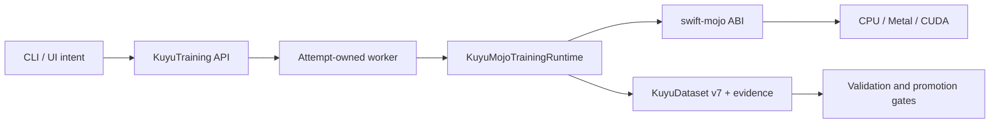
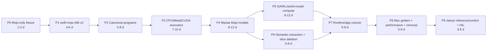
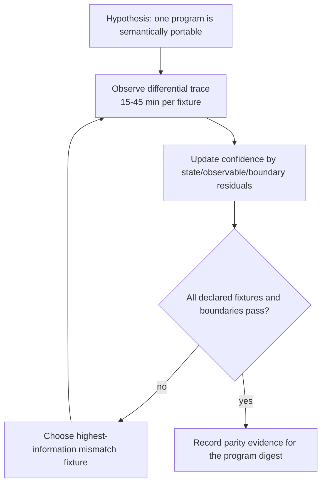

# Kuyu Mojo Migration Ledger

Status: active Mojo-only destructive migration. Mojo 1.0.0 cutover decision is
effective; MLX has no retained runtime or reference role.

This ledger records implementation state. Normative behavior remains in
`SPEC.md` and `LEARNING_SYSTEM_SPEC.md`; package ownership remains in
`../KUYU_PACKAGE_ARCHITECTURE.md`.

## Completion Claim

Mojo 1.0.0 was released on 2026-08-11, and the pinned local compiler is
`Mojo 1.0.0 (ed45d567)`. The language gate is closed. Under
`../MOJO_COMPUTE_ARCHITECTURE.md`, remaining MLX code is removal backlog only.
It may be read to extract semantics, but it may not execute as a production
backend, fallback, differential reference, or qualification oracle.

Kuyu is not Mojo-backed end to end yet. The current application and training
runtime still execute through `kuyu-mlx`; those entry points are non-conforming
and must become typed unavailable paths until their Mojo replacements land.
They are not an accepted interim backend. KuyuPhysics owns the closed canonical
dynamics program and Swift Float64 reference, while `kuyu-mojo` now compiles and
executes the same digest-bound program with real Mojo 1.0 CPU Float64 and
Float32 backends. Float64 is the semantic verifier; Float32 is the explicit
precision rung for future Metal and CUDA execution. Both have passed
differential force, derivative, observable, RK4, zero-boundary, projection,
typed-failure, and strict 400-step/s gates. Their C ABIs are also packaged in a
verified aarch64 Linux ELF archive, but that is not native Jetson execution
evidence. A separate schema-1 receipt now verifies the real MAX object and its
four-library AsyncRT/KGEN closure without weakening the link-closed CPU artifact
policy. The same receipt has now produced an exact isolated bundle whose final
Mach-O imports, relative loader root, and file digests passed fresh verification;
the relocated worker created a real Apple M4 Max device context in a minimal
environment. This proves the macOS deployment boundary, not the Kuyu worker
protocol or a Metal compute kernel. Metal compute, CUDA, native Jetson Swift/CUDA, learning
qualification, sanitizer, and hardware-in-the-loop gates remain unverified
until recorded here.

The first semantic-adaptation slice is implemented independently of those
accelerator gates. `KuyuManasMojoAdapter` validates and snapshots KuyuDataset
v7 through `kuyu-training`, verifies exact on-policy distribution evidence,
converts through an injected `ManasLearningInputEncoding`, applies explicit
transition and complete Float-scalar budgets, and constructs Manas-owned
immutable trajectories. It imports neither MLX nor MAX. It does not yet
implement Manas Mojo models, bundle compatibility, worker snapshots,
model-store gates, or an optimizer.

## Final Usage Contract

The conforming application depends on a backend-neutral training API. Backend
selection is explicit deployment configuration, not a runtime fallback chain.

```swift
let request = try TrainingRunRequest(project: project, plan: plan)
let executor: any TrainingRunExecuting = try KuyuRuntimeFactory.mojo(
    deployment: deployment,
    capabilities: requiredCapabilities
)
let handle = try await executor.start(request)
```

The application never imports a concrete accelerator module. A worker receives
an immutable request and checkpoint snapshot, creates one Mojo session, owns its
device buffers for the attempt lifetime, and publishes only validated Kuyu
artifacts.



## Confirmed Current Facts

| Fact | Evidence | Consequence |
|---|---|---|
| The application directly consumes `KuyuMLX` | `../kuyu-app/Package.swift` and `../kuyu-app/Sources` imports | Every such edge is a conformance blocker; incomplete commands must fail closed rather than keep executing this backend |
| The backend package exposes fourteen MLX products | `../kuyu-mlx/Package.swift` | Each product is removal backlog; extract semantic ownership, replace compute in Mojo, switch callers, and delete the product in one slice |
| The reference quadrotor force, derivative, and observable equations are closed SSA operation graphs with validated layouts, shapes, units, differentiability propagation, fidelity partitions, integration stages, and a stable digest | `../kuyu-physics/Sources/KuyuPhysics/Canonical`, `../kuyu-physics/Sources/KuyuPhysics/Plant/ReferenceQuadrotorCanonicalProgram.swift` | The Swift Float64 path is the semantic reference consumed by Plant and IMU; Mojo executors must consume this program rather than copy equations |
| The canonical integrator selects the declared integration scheme and evaluates graph-derived RK4 derivatives; RK4 stage arithmetic remains the Swift Float64 reference implementation | `../kuyu-physics/Sources/KuyuPhysics/Plant/ReferenceQuadrotorCanonicalIntegrator.swift` | P3 must match every declared projection stage and the reference trace before accelerator promotion |
| `swift-mojo` proves scoped Float32 and Float64 borrowed calls, synchronous session, and session-owned host Float32-buffer lifecycle with exact-count synchronous host copies on universal macOS; it cross-generates a schema-5 aarch64 Linux static artifact bundle, rejects archives that omit the compiled ELF object, rejects undeclared accelerator runtime symbols before archiving, and provides schema-1 accelerator receipts and isolated bundles | `swift-mojo` commits `9382a34`, `4f3f2e7`, `164f571`, and `438e2ab`; ADRs 0007 through 0011 | CPU Float64 canonical execution can use a scoped no-escape bridge; accelerator dependency and macOS deployment identities are verified independently; the Kuyu worker protocol and MAX-backed Apple allocation/synchronization precede Mac training cutover, while native Jetson evidence precedes only Jetson robot deployment |
| `kuyu-mojo` executes all closed canonical opcodes through one dtype-generic Mojo SSA interpreter without copied quadrotor equations or a reference fallback | `kuyu-mojo` commit `235821c`, `PARITY_CONTRACT.md`, `RELIABILITY_EVIDENCE.md`, and `ACCELERATOR_ARCHITECTURE.md` | macOS arm64 CPU Float64 and Float32 are implemented and qualified for the fixed reference digest; their Linux ARM64 ABIs are cross-verified, while accelerator compute rungs remain unavailable rather than silently selecting CPU |
| MAX `26.5.0` exposes a real Apple GPU through `max.gpu.host.DeviceContext`, while accelerator objects require an exact AsyncRT/KGEN dynamic closure | Receipt `050ceac20bc593aed6e36757c050e01a0f0ec7d002bcebb49f3675d77ba4e179` and isolated bundle `38075467012f877bb5ea23daf3d4639aa175b478bfaca898706bd33e1ff72e77` over the real object and four runtime libraries | Relative loader packaging, final Mach-O inspection, fresh bundle verification, and relocated device-context execution are implemented; Kuyu protocol and compute remain |
| Apple Metal rejects the canonical Float64 kernel but accepts Float32 compilation through the final `metallib` step | Real MAX compiler probes on Apple M4 Max | The portable semantic contract is one canonical Float64 program with declared Float32 accelerator materialization, not one dtype on every device |
| Mojo cross-compiles a Float32 CUDA `DeviceContext` program to AArch64 ELF for `cortex-a78ae` and recognizes Jetson Orin as `sm_87`; the embedded cross-build PTX remained `.target sm_80` | Object and assembly inspection with Mojo `1.0.0 (ed45d567)` | Host cross-generation is real and the PTX is Orin-JIT-compatible, but native Jetson target specialization, link, and execution remain mandatory acceptance evidence |
| Manas still exposes MLX-specific model/runtime/training products | `../manas/Package.swift` | These products are conformance blockers and must be replaced by Manas-owned Mojo modules without moving model ownership into Kuyu |
| The validated v7-to-Manas conversion formerly lived only in the MLX backend package | `../kuyu-mojo/Sources/KuyuManasMojoAdapter` and its behavioral tests | The conversion and exact distribution-evidence boundary now has its final Mojo-owned target; MLX provides no continuing reference role |

## Source Ownership Migration

| Current source target | Final owner | Action |
|---|---|---|
| `KuyuMLXCore` | `swift-mojo` and `KuyuMojoCore` | Move generic ABI/ownership/artifact logic upstream; keep only Kuyu capability and session composition downstream |
| `KuyuManasMLXAdapter` | `manas` and `KuyuManasMojoAdapter` | Keep Manas model/bundle structure in Manas; keep Kuyu v7 conversion and model-store gates in the adapter |
| `KuyuMLXEvolution` | `KuyuMojoEvolution` | Port mutation, crossover, inference, and scoring compute behind `kuyu-training` protocols |
| `KuyuMLXReinforcement` | `KuyuMojoReinforcement` | Port policy distributions and optimizer kernels without reconstructing scenario semantics |
| `KuyuMLXWorldModel` | `KuyuMojoWorldModel` | Port compute only; authoritative physics remains in `kuyu-physics` |
| `KuyuMLXCampaignContracts` | `kuyu-training` | Move generic campaign contracts; do not create backend-prefixed replacements |
| `KuyuMLXCampaignValidation` | `kuyu-training` | Move generic artifact and gate validation |
| `KuyuMLXCampaignRuntime` | `kuyu-training` plus `KuyuMojoTrainingRuntime` | Separate lifecycle semantics from concrete compute composition |
| `KuyuMLXReferenceQuadrotor` | `kuyu-physics`, `kuyu-scenarios`, `kuyu-training`, and `kuyu-mojo` | Move equations/scenario meaning/contracts to their authorities; port only compute execution |
| `KuyuMLXRoArmM1` | `kuyu-physics`, `kuyu-scenarios`, `kuyu-training`, and `kuyu-mojo` | Apply the same split through descriptor-driven robot boundaries |
| `KuyuMLXTrainingRuntime` | backend-neutral runtime facade plus `KuyuMojoTrainingRuntime` | Preserve one lifecycle path while replacing its compute implementation |
| `KuyuMLX` | none | Delete after app cutover; do not ship a compatibility facade |
| `KuyuMLXTrainingProbe` | test and diagnostic targets | Remove from the production public API |

## Ownership and Lifetime Contract

| Resource | Creator | Owner | Lifetime | Isolation and failure contract |
|---|---|---|---|---|
| Training request | CLI/UI adapter | Kuyu runtime | One submitted run | Immutable and digest-bound; invalid input fails before worker launch |
| Attempt context | Worker service | Worker actor | One attempt | Ordered lifecycle transitions; cancellation is explicit |
| Checkpoint snapshot | Launcher | Attempt context | One attempt | Read-only and digest-verified; mutable sharing across workers is prohibited |
| Mojo ABI session | `KuyuMojoCore` | Attempt context | Worker attempt | Explicit `shutdown`; capability mismatch is a typed failure |
| Prepared executable artifact | `swift-mojo` | ABI session | Session or verified cache lease | Target triple and digest must match; no path-only trust |
| Device buffers | Mojo session | Mojo session | Bounded operation/session scope | Owner-retained views only; pointers do not escape their borrow scope |
| Canonical world program | `kuyu-physics` | Immutable value | Program revision | Closed opcodes and validated layouts; stable digest identifies semantics |
| Scenario execution plan | `kuyu-scenarios` | Immutable value | Scenario revision | Backends consume one plan; unsupported capabilities fail closed |
| Progress journal | Training runtime | Attempt artifact store | Durable attempt history | Monotonic, attempt-bound, synchronized before live publication |
| Accepted model bundle | Manas publisher | Immutable artifact store | Published revision | Reloaded bytes must reproduce evaluated inference before atomic promotion |

## Implementation Gates and Critical Path

The estimates are engineering time ranges, not elapsed promises. P1 through P8
form the Mac training critical path because each establishes a contract consumed
by the next stage. Semantic relocation in P6 can overlap late P4/P5 after its
destination contracts are frozen. P9 qualifies Jetson inference/control and
HIL deployment after an accepted artifact exists; it does not block Mac
training performance qualification or MLX removal.



| Gate | Deliverable | Exit condition | State |
|---|---|---|---|
| P0 | Mojo-only authority freeze | Specs agree; new MLX imports, features, runtime selection, and test-oracle use are rejected | In progress: normative decision updated; static import/product gate and runtime disablement remain |
| P1 | `swift-mojo` ABI v2 | Owned buffers/state, scoped borrows, typed capabilities, shutdown, and target artifact verification | In progress: scoped Float32/Float64 borrows, session/resource ownership, exact-count synchronous host transfer, host Float32-buffer lifecycle, Linux ARM64 cross packaging, accelerator receipts, and exact macOS bundle link/run are complete; the production Kuyu protocol and complete device-owned training session remain |
| P2 | Canonical dynamics and sensor programs | Closed opcodes, layouts, units, differentiability, integration/projection stages, stable digest | Complete for the reference quadrotor program and Swift Float64 semantic executor; digest `6c6773c5a824508fd683390aa7a4acdc1636e8c8483f6ac9ee9667bf62d54310` |
| P3 | Mojo world executors | CPU `Float64`, Metal, and CUDA consume the same program without copied equations or fallback | In progress: macOS arm64 CPU Float64 and Float32 are implemented and qualified, and both Linux ARM64 ABIs are cross-packaged; Metal, CUDA, and native Jetson execution remain |
| P4 | Manas Mojo implementation | Core/Reflex model structure remains Manas-owned; runtime and training satisfy bundle contracts | In progress: portable models, CPU Core/Reflex runtime, backend-neutral accelerator transport, and device-resident Adam exist; accelerator Core/Reflex and complete training remain |
| P5 | Kuyu Mojo compute | Vectorized world, GA, PPO/SHAC, and world-model protocols have real production conformers | Not started |
| P6 | Semantic extraction and slice deletion | Scenario, campaign, and artifact semantics no longer live in a backend package; each replaced MLX target is deleted with its callers | In progress: validated KuyuDataset v7-to-Manas conversion and exact behavior-evidence verification now live in `KuyuManasMojoAdapter`; remaining campaign/profile semantics and MLX targets remain blockers |
| P7 | Single runtime cutover | CLI/UI use one backend-neutral API and no concrete backend imports | Not started |
| P8 | Mac qualification and removal | Independent scalar/closed-form fixtures, Mojo CPU/accelerator parity, v7 integrity, Mac golden learning, predeclared training-performance budgets, and zero-MLX repository scan pass | Not started |
| P9 | Jetson deployment qualification | Accepted artifact passes native load, inference parity, bounded control latency, memory/power, cancellation/shutdown, and HIL safety gates; optimizer throughput is out of scope | Not started |

## Iterative Verification Loops



The loop converges only when every declared fixture, projection boundary,
failure classification, and device class meets its tolerance. A time or run
limit does not count as convergence; remaining uncertainty must be recorded.

The learning loop similarly converges only when a reloaded candidate improves
held-out task quality and passes safety/failure gates. A non-empty dataset,
finite loss, changed weights, or successful process exit is insufficient.

## P0 Work Log

| Change | State | Evidence |
|---|---|---|
| Mojo authority and package graph frozen | Committed | `SPEC.md`, `LEARNING_SYSTEM_SPEC.md`, `../KUYU_PACKAGE_ARCHITECTURE.md` |
| Canonical buffer, instruction, graph, fidelity, integration, and digest contracts | Implemented and validated | `../kuyu-physics/Sources/KuyuPhysics/Canonical`, `CanonicalBufferLayoutTests.swift`, and `CanonicalDynamicsProgramTests.swift` |
| Stable digest value validation | Implemented with decode-time recomputation and a fixed reference golden | `CanonicalProgramDigest.swift`; reference digest `6c6773c5a824508fd683390aa7a4acdc1636e8c8483f6ac9ee9667bf62d54310` |
| Closure/RK4 canonical gap | Removed from the production path | Closure-backed force-term types and duplicated `ReferenceQuadrotorDynamics` were deleted; Plant and IMU consume the canonical program through `ReferenceQuadrotorScalarDynamicsExecutor`; the integrator dispatches the declared RK4 scheme |
| Full `KuyuPhysicsTests` target | Passed | 119 of 119 tests passed under bounded `xcodebuild test`, including differentiability propagation and the strict 400-step/s canonical-kernel budget |
| Source-risk audit | Executed | `unconscious/scripts/audit-dangerous-code.sh --verbose`: 0 blockers; 44 existing oversized-production-file review findings retained for separate review |
| Full reference canonical opcode program | Implemented | Nine force terms, derivative, observables, full/single-prop fidelity partitions, and RK4 projection stages share one validated program |
| Mojo package and complete ABI v2 | Partially implemented upstream | Caller-owned Float32 and Float64 mutable host-buffer calls, synchronous session, session-owned Float32-buffer create/copy/shutdown, and schema-5 Linux ARM64 cross artifact are implemented; the complete attempt-owned training ABI and device-residency telemetry remain P1 blockers |
| Build/test/benchmark/device evidence | Partially executed | KuyuPhysics 119/119, KuyuScenarios 127/127, KuyuMojoDynamics 10/10, strict 400-step/s Swift and Mojo CPU budgets, package-wide `swift-mojo` 164/164, real Mojo macOS Float32/Float64 and session/resource acceptance, exact MAX bundle verification and relocated Apple-device-context execution, AArch64 CUDA cross-object inspection, and aarch64 Linux cross-artifact inspection executed. Sanitizer, native Jetson, GPU-kernel execution, and HIL evidence remain; Metal kernel execution is environment-blocked because the installed Xcode lacks the optional Metal Toolchain component |

## P1 Work Log

| Change | State | Evidence |
|---|---|---|
| `([Float], inout [Float]) throws -> Void` semantic IR and macro | Implemented and tested | `swift-mojo/Sources/MojoBindingCore`, `MojoMacros`, and package-wide `xcodebuild test` |
| Scoped immutable/mutable C and Mojo pointer ABI | Implemented and real-runtime verified on arm64 macOS | Generated `const float *` / `float *` dispatcher; real Mojo 1.0 changed `[1, 2, 3]` to `[2, 4, 6]` |
| Recoverable Mojo invocation status | Implemented and real-runtime verified | status `0` succeeds; status `7` produced `MojoInvocationError.invocationFailed` |
| Empty input/output failures | Implemented and real-runtime verified | distinct `emptyBorrowedBuffer` and `emptyMutableBuffer` paths |
| Static consumption | Verified locally | four bridge symbols present; final consumer had no Mojo dynamic dependency |
| Ownership scope | Caller-owned host buffers only | Both pointers end with the synchronous nested borrow; no device/session ownership is claimed |
| `([Double], inout [Double]) throws -> Void` scoped ABI | Implemented, package-tested, and real-runtime verified on arm64 macOS | Commit `9382a34`; generated `const double *` / `double *` dispatcher, recoverable status, empty-buffer failures, static link/run, and no Mojo dynamic dependency |
| Opaque session binding IR and macro | Implemented and tested | factory requires a paired shutdown; use binding names its Swift factory and must remain in the same external package |
| Versioned create/use/shutdown ABI | Implemented and real-runtime verified on arm64 macOS | flat schema-v1 request/response, `void *` handle, session-bound mutable-buffer dispatcher, and paired shutdown symbols |
| Session ownership and isolation | Verified locally | `Mutex<State>` owner, factory-domain identity, single synchronous lease, typed reentrant/concurrent `busy`, typed use-after-shutdown, idempotent explicit shutdown, and deinit fallback |
| Creation cleanup and capability failure | Verified locally | nonzero status/schema/device/ordinal/capability rejection destroys every returned handle exactly once; no device fallback |
| Session-owned Float32 resource | Verified locally on universal macOS host memory | generated factory/create/destroy/copy ABI, required post-copy synchronization binding, typed host/device/pinned-host memory kind, capability/size/count validation, round-trip transfer, nonzero transfer/create and missing-handle cleanup, parent-before-child rejection, idempotent child shutdown, exactly-once child-before-parent destruction |
| Static session/resource consumption | Verified locally | ten bridge symbols present; final consumer had no Mojo or KGEN dynamic dependency |
| MAX GPU host API probe | Verified in an isolated tool environment | Modular/MAX `26.5.0` and Mojo `1.0.0` created a real Apple M4 Max `DeviceContext`; standalone Mojo remains intentionally insufficient because it does not ship the MAX host runtime |
| Accelerator runtime receipt | Implemented and real-input verified | `swift-mojo` commit `438e2ab`; schema-1 receipt binds object/library digests, target architecture, exact symbol providers, transitive Mach-O/ELF closure, and canonical system dependencies. Real MAX receipt `050ceac20bc593aed6e36757c050e01a0f0ec7d002bcebb49f3675d77ba4e179` resolves 15 object symbols through four libraries; an omitted transitive library fails before linking |
| Isolated accelerator bundle | Implemented and real-input verified on macOS | `swift-mojo` commit `438e2ab`; bundle `38075467012f877bb5ea23daf3d4639aa175b478bfaca898706bd33e1ff72e77` binds the receipt, executable, four copied libraries, direct system boundary, and sole `@executable_path/../lib` loader root. Fresh verification passed and relocated minimal-environment execution created an Apple M4 Max context |
| Linux ARM64 static artifact | Cross packaging verified | `swift-mojo` commit `438e2ab` plus `kuyu-mojo` commit `235821c`; real Mojo `aarch64-unknown-linux-gnu` ELF object, schema-5 SE-0482 artifact bundle, required `Bindings.o` member verification, Float32 and Float64 symbols, archive digest `85651efd647c619813cc5359bed719e841bb8871ed6a2731b06965998bedf1d4`, and only libc `memset` undefined |
| Native Jetson deployment acceptance | Not verified | Swift import/link/run, accelerator capability negotiation, device allocation/transfer/synchronization, model inference, bounded control latency, success/failure paths, and dynamic dependency evidence are required for P9 robot deployment, not P1 Mac training completion |

## P3 Work Log

| Change | State | Evidence |
|---|---|---|
| `kuyu-mojo` package boundary | Implemented and pushed | Public repository `1amageek/kuyu-mojo`, commit `235821c`; `KuyuMojoCore` and `KuyuMojoDynamics` keep canonical semantics in KuyuPhysics and select platform artifacts through SwiftPM conditions |
| Canonical program compiler | Implemented | Closed opcode mapping, validated shapes/units, numeric-specific exact-integer limits and plan magic, immutable digest-bound execution identity, finite conversion validation, and no target-conditioned mutable state |
| Generic Mojo CPU Float64/Float32 interpreter | Implemented with real Mojo 1.0 artifacts | Two external bindings, aggregate artifact digest `379d4e137fa359d8c1404ed7e07be4adbb0cc44a58ca3fad3f32c85617859e78`; native macOS arm64 execution plus cross-verified Linux ARM64 ELF; no quadrotor equations in Mojo source |
| Differential and boundary convergence | Passed | 10/10 bounded `xcodebuild` tests for both numeric types covering full/single-prop force, derivative, observables, 20-step RK4, zero norm, projection, digest/fidelity/input/plan/arithmetic/conversion failures; Float32 maximum absolute residuals were force `4.60e-7`, derivative `2.10e-6`, observables `5.25e-7`, RK4 state `6.38e-8`, and zero boundary `4.59e-7` |
| CPU real-time floor | Passed | `KUYU_MOJO_STRICT_PERFORMANCE_BUDGETS=1`; Float32 `795.27` and Float64 `1410.88` complete RK4 steps/s both exceeded the 400 steps/s floor |
| Workspace boundary and source-risk review | Passed | Kuyu and unconscious boundary validators passed; source-risk audit reported zero blockers and no new unsafe-memory/precondition/oversized-source finding in `kuyu-mojo` |
| Accelerator deployment preflight | Implemented on macOS; compute not implemented | MAX device detection, Metal dtype behavior, schema-1 receipt and exact bundle, final Mach-O inspection, relocated device-context execution, and AArch64 CUDA cross-generation are verified; Kuyu worker protocol, optional Xcode Metal Toolchain, real Metal kernel run, native Jetson link/run, and device-owned session buffers remain |

## Immediate Next Slice

1. Add a static package/import gate that rejects new `mlx-swift`, `ManasMLX*`,
   `KuyuMLX*`, and `kuyu-mlx` edges, and classify every existing edge as a
   removal slice.
2. Move backend-neutral campaign, profile, rollout, and artifact semantics out
   of MLX-named targets before writing their Mojo compute replacements.
3. Implement `KuyuMojoReinforcement` as one attempt-owned device-resident
   rollout, GAE, autodiff, optimizer, rollback, and bounded-telemetry session.
4. Switch the first production training command directly to the backend-neutral
   Mojo facade and delete the replaced MLX target and callers in the same slice.
5. Complete authenticated worker lifecycle and qualify the full Mac Mojo
   training path with elapsed-time rates, transfer/synchronization counts,
   memory, cancellation, and sustained thermal evidence.
6. After an accepted checkpoint exists, qualify Jetson artifact load,
   inference/control latency, memory/power, cancellation/shutdown, and HIL
   safety without adding Jetson optimizer throughput to the training gate.
