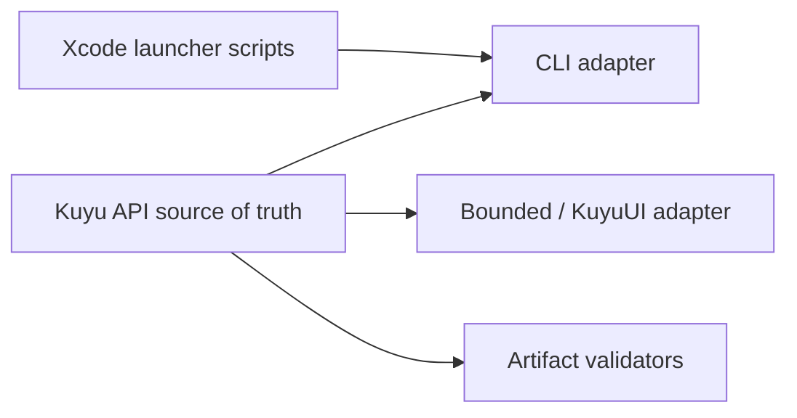

# kuyu-app

Application adapter layer for the Kuyu simulation and training environment.
It provides the CLI and SwiftUI adapters used by Bounded, while Manas/MLX
backend execution lives in the sibling `kuyu-mlx` package.

## Overview

Kuyu is a simulation environment for training and evaluating [Manas](https://github.com/1amageek/manas) controllers. This package composes the UI and CLI adapters over the shared Kuyu runtime APIs.

### Modules

| Module | Description |
|--------|-------------|
| **KuyuMLX** | Imported from `kuyu-mlx`; Manas-MLX bridge, learning campaign runner, checkpoint evaluator, and regression gate implementation |
| **KuyuUI** | SwiftUI-based GUI that operates Kuyu APIs and renders typed events/artifacts |
| **KuyuCLI** | Command-line adapter that maps arguments into the same Kuyu APIs used by the UI |

### Runtime Basis

Current `kuyu` runtime uses physics simulation as the source of truth.
The world-model package is not authoritative physics. In M2 smoke execution it
is used as a validated checkpoint and imagination-training gate, while
analytical physics remains the reference.

`AscendingChannelMapper` includes world-model-compatible channel layout helpers, but
runtime simulation and evaluation are currently physics-based.

Kuyu owns the training-world boundary: physics execution, scenarios, reward,
rollout, dataset export, visual inspection, and CLI/UI orchestration. Manas
control protocol internals, Manas model internals, and concrete RL optimizers
remain outside Kuyu.

### API-First UI/CLI Boundary

Kuyu is the base runtime. Bounded/KuyuUI and KuyuCLI must operate Kuyu through
typed in-process APIs instead of reimplementing training or checkpoint logic in
the application layer.



| Layer | Owns | Must not own |
|-------|------|--------------|
| **KuyuTraining** | Task profiles, rollout contracts, evaluation artifacts, project package contracts | Manas model internals |
| **KuyuMLX** | Campaign execution, checkpoint evaluation, regression gates, continuation selection | UI layout or independent app state |
| **KuyuCLI** | Argument parsing, event printing, exit-code mapping | Acceptance gates or artifact validity decisions |
| **KuyuUI / Bounded** | User interaction, visualization, artifact browsing, progress display | Training success logic, checkpoint acceptance, readiness checks |
| **Shell scripts** | Xcode build/launch convenience and environment wiring | Learning success/failure decisions |

If a training, evaluation, continuation, or checkpoint publication feature is
visible in Bounded, the same behavior must be reachable through the Kuyu API and
CLI adapter. UI-only features are limited to visualization, inspection, and
debug presentation.

### CLI Usage

```bash
# Run simulation with the teacher/reference baseline controller
swift run -c release kuyu run --controller baseline

# Run the sensor-only baseline controller
swift run -c release kuyu run --controller sensorBaseline

# Run with Manas MLX controller
swift run -c release kuyu run --controller manasMLX --model path/to/model.json

# Training loop
swift run -c release kuyu loop --iterations 10 --epochs 4 --lr 0.001

# RL environment rollout smoke
swift run -c release kuyu rollout --controller teacherBaseline --episodes 2 --workers 1
swift run -c release kuyu rollout --controller teacherBaseline --episodes 8 --workers 4

# M2 world-model and imagination-training smoke
swift run -c release kuyu rollout --controller teacherBaseline --episodes 2 --workers 1 --export-dataset /tmp/kuyu-rollout-dataset
swift run -c release kuyu train-world-model --dataset /tmp/kuyu-rollout-dataset --save-model /tmp/kuyu-world-model --epochs 1 --max-batches 1
swift run -c release kuyu imagine-train --world-model /tmp/kuyu-world-model --save-model /tmp/kuyu-imagination --horizon 2 --epochs 1

# SwiftPM release MLX smoke runs need the MLX Metal library next to the binary
./scripts/install-mlx-metallib.sh release
swift run -c release kuyu loop --iterations 1 --epochs 1 --lr 0.001 --save-model /tmp/kuyu-model-smoke

# Preferred MLX/Metal E2E path: build/test with Xcode, then run the Xcode-built kuyu binary
./scripts/check-xcode-e2e.sh /tmp/kuyu-xcode-e2e

# Learning campaign path: use the typed Swift API through the Xcode-built app or CLI.
# Shell campaign launchers were removed so readiness, resume, and acceptance stay in Kuyu runtime code.
xcodebuild build -scheme kuyu-app-Package -destination 'platform=macOS'
kuyu run-learning-campaign --artifact-root /tmp/kuyu-learning-campaign

# Validate a completed campaign before using its final checkpoint
./scripts/validate-learning-campaign-artifacts.sh /tmp/kuyu-learning-campaign
kuyu validate-learning-campaign --artifact-root /tmp/kuyu-learning-campaign

# RoArm M1 guarded hardware probe; dry-run by default
swift run kuyu probe-roarm-m1
swift run kuyu probe-roarm-m1 --device /dev/cu.usbserial-0001 --enable-motion

# RoArm M1 camera-free arm and gripper smoke training
swift run kuyu train-roarm-m1-arm-gripper --output /tmp/kuyu-roarm-m1-arm-gripper-training --duration 2.0 --seed 7
```

See `ROARM_M1_SIMULATION.md` for the Kuyu/RealityKit simulator path, and
`ROARM_M1_TRAINING.md` for the first camera-free arm and gripper training goal.
`ROARM_M1_HARDWARE_PROBE.md` covers the manifest, embodiment, MotorNerve,
encoder, and serial-write boundary used by the first RoArm M1 hardware test.

### M1.5 RL Environment Acceptance

M1.5 means Kuyu exposes a reinforcement-learning environment contract, not a complete RL algorithm. The accepted baseline is:

- `reset / step / reward / done / truncated / info` exist as typed environment values.
- The primary policy action is `DriveIntent`; direct actuator actions remain teacher/test escape hatches.
- Reward and terminal semantics are finite and deterministic for the ATT and lift reference scenarios.
- Serial and parallel rollout produce deterministic merged artifacts ordered by scenario, seed, and worker index.
- Parallel rollout uses independent environment and policy instances per worker. Shared `ManasMLXModelStore` execution is intentionally excluded until M2.
- `kuyu rollout --model <robot-manifest>` constructs the environment from the manifest, body, world, and embodiment contracts. Invalid paths fail closed and never fall back to baseline.

### M1.6 Runtime Reliability Acceptance

M1.6 fixes the execution boundary around native robot contracts, UI commands, and MLX/Metal preflight:

- A non-empty robot manifest path must load successfully; manifest, body, world, embodiment, compatibility, and readiness failures are terminal errors.
- `ReferenceQuadrotorParameters.baseline` is allowed only for tests, CLI smoke, and display-only preview fallback.
- KuyuUI user operations route through `SimulationViewModel -> CommandSystem -> Service`; views do not mutate simulation state directly.
- KuyuUI user operations log `kuyu.ui` with action/task/robot manifest context. Preflight errors include reason and error details.
- `manasMLX` and `kuyu loop` perform MLX metallib preflight before execution and do not fall back to baseline.

Dependency-order verification:

```bash
cd ../manas && python3 -c 'import subprocess,sys; sys.exit(subprocess.run(sys.argv[2:], timeout=int(sys.argv[1])).returncode)' 60 swift test
cd ../kuyu-core && python3 -c 'import subprocess,sys; sys.exit(subprocess.run(sys.argv[2:], timeout=int(sys.argv[1])).returncode)' 60 swift test
cd ../kuyu-physics && python3 -c 'import subprocess,sys; sys.exit(subprocess.run(sys.argv[2:], timeout=int(sys.argv[1])).returncode)' 60 swift test
cd ../kuyu-scenarios && python3 -c 'import subprocess,sys; sys.exit(subprocess.run(sys.argv[2:], timeout=int(sys.argv[1])).returncode)' 60 swift test
cd ../kuyu-training && python3 -c 'import subprocess,sys; sys.exit(subprocess.run(sys.argv[2:], timeout=int(sys.argv[1])).returncode)' 60 swift test
cd ../kuyu && python3 -c 'import subprocess,sys; sys.exit(subprocess.run(sys.argv[2:], timeout=int(sys.argv[1])).returncode)' 120 swift test
swift run kuyu rollout --controller teacherBaseline --episodes 2 --workers 1
swift run kuyu rollout --controller teacherBaseline --episodes 8 --workers 4
```

### Verification Split

SwiftPM is the default path for non-MLX contracts: CLI parsing, manifest/body/world/embodiment loading, RL environment types, scenario execution, rollout harnesses, and dataset export.

Xcode is the authority for MLX and Metal-backed execution. Use it for `ManasMLXModelStore` load/train/save smoke tests, app-level MLX tests, and `kuyu-world-model` validation:

```bash
xcodebuild test -scheme kuyu -destination 'platform=macOS' -maximum-test-execution-time-allowance 60
./scripts/check-xcode-e2e.sh /tmp/kuyu-xcode-e2e
cd ../kuyu-world-model
xcodebuild test -scheme kuyu-world-model -destination 'platform=macOS' -maximum-test-execution-time-allowance 60
```

`check-xcode-e2e.sh` runs `xcodebuild test`, executes teacher regression, creates a ManasMLX checkpoint, evaluates that checkpoint as the incumbent, and runs a small evolution gate. It validates the produced artifacts, including `accepted-checkpoint.json` and `evaluation-trace.jsonl`.

Learning readiness, resume selection, artifact validation, and checkpoint acceptance must live in typed Swift runtime APIs. Shell campaign wrappers were removed because they duplicated policy and made UI/CLI behavior diverge. Use the Xcode-built app or CLI so MLX/Metal resources and the same runtime contracts are active.

`kuyu validate-learning-campaign` is the Swift post-run artifact gate. It checks plan/status/progress/environment/resource samples, verifies every seed has complete evolution artifacts, checks fitness counts against population/generations, and rejects an incomplete final checkpoint before it is used as a future source checkpoint. `validate-learning-campaign-artifacts.sh` is a compatibility wrapper around that Swift command.

SwiftPM release binaries can run MLX only when the MLX default metallib is installed next to the executable. Prefer `./scripts/install-mlx-metallib.sh release` for SwiftPM smoke runs, but use the Xcode-built binary when testing Metal resources or checkpoint acceptance.

### M2 World-Model Entry

M1.5 uses analytical physics as the source of truth. `kuyu-world-model` remains a separately verified model package and does not replace scenario physics.

M2 introduces a world-model adapter behind the environment/rollout boundary:

- Keep analytical physics as the reference validator.
- Train a `StateWorldModel` residual checkpoint from rollout dataset fields.
- Validate the `StateWorldModel` checkpoint before `imagine-train` publishes a Manas checkpoint.
- Reject missing, non-finite, high-uncertainty, or threshold-exceeding world-model predictions before imagination training continues.
- Use per-worker model snapshots or an actor pool; do not share a reentrant `ManasMLXModelStore` across parallel rollout workers.
- Compare imagined rollouts against physics replay before accepting world-model rewards or terminations.
- Keep `kuyu-world-model` acceptance in Xcode/Metal verification until SwiftPM can reliably provide the required MLX resources.

## Architecture

```
kuyu-app (this package)
  |
  +-- KuyuUI
  |     depends: KuyuCore, KuyuPhysics, KuyuScenarios,
  |              KuyuTraining, KuyuMLX from kuyu-mlx,
  |              swift-log, swift-configuration
  |
  +-- KuyuCLI
        depends: KuyuCore, KuyuPhysics, KuyuScenarios,
                 KuyuTraining, KuyuMLX from kuyu-mlx,
                 swift-argument-parser
```

## Full Dependency Graph

```
KuyuCore ------------------- (zero dependencies)
  |
KuyuPhysics
  |
KuyuScenarios
  |
KuyuTraining
  |
kuyu-mlx + manas
  |
kuyu-app (this package)
```

## Requirements

- Swift 6.2+
- macOS 26+
- Apple Silicon (MLX Metal runtime)

## Related Packages

- [kuyu-core](https://github.com/1amageek/kuyu-core) — Core protocols and types
- [kuyu-physics](https://github.com/1amageek/kuyu-physics) — Physics engines and analytical models
- [kuyu-scenarios](https://github.com/1amageek/kuyu-scenarios) — Evaluation scenarios and logging
- [kuyu-training](https://github.com/1amageek/kuyu-training) — Backend-agnostic training contracts, project packages, runtime orchestration, GA/RL protocols, and artifact validation
- [kuyu-mlx](https://github.com/1amageek/kuyu-mlx) — Manas/MLX backend implementation for Kuyu training contracts
- [manas](https://github.com/1amageek/manas) — CNS-style robotic control system

## License

See repository for license information.
