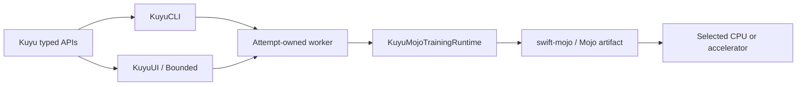

# kuyu-app

Application adapters for the Kuyu simulation and training environment. This
package owns the CLI, SwiftUI presentation, and the shared worker adapter used
by Bounded. It does not own training semantics or numerical kernels.

## Compute Direction

Mojo 1.0.0 is the sole conforming numerical compute substrate. The normative
decision is recorded in `../MOJO_COMPUTE_ARCHITECTURE.md` and the Kuyu behavior
contract is in `SPEC.md`.



MLX is not a production backend, fallback, reference implementation, or test
oracle. The current package still contains direct `KuyuMLX*` dependencies;
those are known conformance blockers and removal backlog. They MUST NOT be used
as a template for new work. Until a command has a complete Mojo implementation,
its conforming behavior is typed unavailability rather than MLX execution.

## Modules

| Module | Responsibility |
|---|---|
| `KuyuWorkerRuntime` | Authenticated worker invocation and attempt lifecycle adaptation |
| `KuyuUI` | Read-only presentation, user intent, progress and artifact inspection |
| `KuyuCLI` | Argument mapping, event printing, and exit-code mapping |

The target compute dependency is `kuyu-mojo` through the backend-neutral Kuyu
runtime facade. UI and CLI do not import concrete Mojo modules and do not select
Metal, CUDA, or another vendor API.

## Authority Boundary

| Layer | Owns | Must not own |
|---|---|---|
| `kuyu-training` | Training plans, lifecycle, rollout contracts, gates, artifacts, validation | Numerical kernels or UI |
| `kuyu-mojo` | Device-resident rollout, autodiff, optimizer, world-model, and canonical-program execution | Scenario meaning, acceptance policy, UI |
| `KuyuWorkerRuntime` | Attempt-bound process composition and typed runtime adaptation | Learning algorithms or success policy |
| `KuyuCLI` | Command parsing and reporting | Acceptance, readiness, or checkpoint validity decisions |
| `KuyuUI` / Bounded | User interaction and read-only visualization | Training success or numerical execution |

If a capability is visible in the UI, the same operation must exist behind the
typed Kuyu API used by the CLI. UI-only behavior is limited to presentation and
debug inspection.

## Current Implementation Gap

The source graph has not completed the destructive cutover:

- `Package.swift` still depends on `../kuyu-mlx`;
- UI, CLI, and worker sources still import `KuyuMLX*` modules; and
- the complete `KuyuMojoReinforcement`, `KuyuMojoWorldModel`, worker, and facade
  products do not yet exist.

This means the current learning commands are migration evidence, not the
accepted production path. New work follows this order:

1. move backend-independent semantics to `kuyu-scenarios` or `kuyu-training`;
2. implement the device-resident compute slice in `kuyu-mojo`;
3. switch the app caller to the backend-neutral facade; and
4. delete the replaced MLX target, tests, resources, and package edge in the
   same slice.

## Simulation and Control Boundary

Analytical Kuyu physics remains the source of truth. A learned world model is an
auxiliary prediction model and never replaces authoritative physics, failure,
reward, or acceptance semantics.

The Manas execution path remains:

```text
sensor streams
  -> NerveBundle
  -> Gating and Trunks
  -> Core plus Reflex
  -> MotorNerve
  -> plant
```

Kuyu owns physics execution, scenarios, stress, rollout evidence, visualization,
and typed orchestration. Manas owns the control protocol and model semantics.
Mojo owns the numerical implementation behind those contracts.

## Worker and Artifact Contract

A long-running run uses an attempt-owned worker. The launcher binds the attempt
to an immutable request, checkpoint snapshot, staged executable, runtime bundle,
and launch digest. Progress is an append-only attempt-bound journal. Cancellation,
crash, rejection, acceptance, and publication are distinct typed terminal states.

The runtime, not the UI or shell, decides checkpoint acceptance. A completed run
is successful only when it contains a validated accepted checkpoint that can be
reloaded and reproduces evaluated inference.

## Verification

Use Xcode for Manas/Kuyu/Mojo runtime and Metal-resource execution. Every test
command must include a timeout and must verify that at least one intended test
executed.

```bash
cd ../kuyu-mojo
xcodebuild test \
  -scheme kuyu-mojo-Package \
  -destination 'platform=macOS' \
  -maximum-test-execution-time-allowance 60

cd ../kuyu
xcodebuild test \
  -scheme kuyu-app-Package \
  -destination 'platform=macOS' \
  -maximum-test-execution-time-allowance 60
```

Independent numerical verification does not use MLX:

- Swift Float64 scalar traces verify canonical dynamics;
- closed-form fixtures verify distributions, GAE, and optimizer trajectories;
- finite differences verify bounded gradient fixtures;
- Mojo CPU and accelerator artifacts verify declared numerical parity; and
- a golden campaign must publish a reloadable improved checkpoint without
  safety regression.

## Related Specifications

- `SPEC.md` — Kuyu behavior and responsibility boundary
- `LEARNING_SYSTEM_SPEC.md` — learning data, optimizer, lifecycle, publication,
  and destructive migration contracts
- `MOJO_MIGRATION.md` — current implementation ledger
- `../KUYU_PACKAGE_ARCHITECTURE.md` — package and target ownership
- `../MOJO_COMPUTE_ARCHITECTURE.md` — cross-program Mojo-only compute decision
- `ROARM_M1_SIMULATION.md` — RoArm simulation path
- `ROARM_M1_TRAINING.md` — RoArm learning objective
- `ROARM_M1_HARDWARE_PROBE.md` — guarded hardware boundary

## Requirements

- Swift 6.2+
- macOS 26+ for the Apple application
- Mojo 1.0.0 or an explicitly adopted compatible 1.x release
- Apple Silicon or Linux ARM64 NVIDIA deployment artifacts as qualified by the
  owning Mojo acceptance gates

## License

See the repository for license information.
