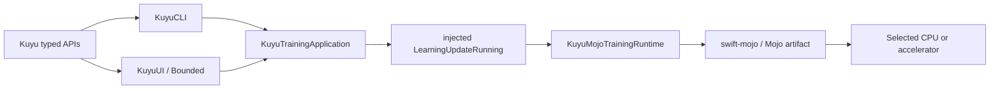

# kuyu-app

Application adapters for the Kuyu simulation and training environment. This
package owns the CLI, SwiftUI presentation, and the backend-neutral learning
application service used by Bounded. It does not own numerical kernels.

## Compute Direction

Mojo 1.0.0 is the sole conforming numerical compute substrate. The normative
decision is recorded in `../MOJO_COMPUTE_ARCHITECTURE.md` and the Kuyu behavior
contract is in `SPEC.md`.



The package graph contains one learning backend. Missing or incompatible Mojo
artifacts are reported as typed failures; there is no numerical fallback.

## Modules

| Module | Responsibility |
|---|---|
| `KuyuTrainingApplication` | Request construction, cancellation, and single-run lifecycle |
| `KuyuUI` | Read-only presentation, user intent, progress and artifact inspection |
| `KuyuCLI` | Argument mapping, event printing, and exit-code mapping |

The UI depends only on the backend-neutral application facade. Executables
inject `KuyuMojoLearningUpdateExecutor`; they do not select Metal, CUDA, or
another vendor API.

## Authority Boundary

| Layer | Owns | Must not own |
|---|---|---|
| `kuyu-training` | Dataset, learning-request, lifecycle, and artifact contracts | Numerical kernels or UI |
| `kuyu-mojo` | Dataset-to-candidate orchestration and concrete Mojo execution | Scenario meaning or UI |
| `KuyuTrainingApplication` | Request construction, cancellation, application lifecycle | Learning arithmetic or backend ABI |
| `KuyuCLI` | Command parsing and reporting | Acceptance, readiness, or checkpoint validity decisions |
| `KuyuUI` / Bounded | User interaction and read-only visualization | Training success or numerical execution |

If a capability is visible in the UI, the same operation must exist behind the
typed Kuyu API used by the CLI. UI-only behavior is limited to presentation and
debug inspection.

## Implemented Path

`kuyu train` and Bounded submit the same `LearningUpdateRequest`. The concrete
runtime verifies source and dataset digests, validates exact behavior-policy
evidence, executes recurrent PPO and Adam in Mojo, publishes the complete
candidate atomically, and reloads the result before returning success.

`kuyu simulate` executes the real Kuyu reference scenario runner with either a
sensor or teacher controller and can require deterministic replay verification.
It is not a mock of the training path.

## Simulation and Control Boundary

Analytical Kuyu physics remains the source of truth. A learned world model is an
auxiliary prediction model and never replaces authoritative physics, failure,
reward, or acceptance semantics.

The Manas execution path remains:

```text
sensor streams
  -> NerveBundle
  -> Gating and Trunks
  -> Core plus Reflex
  -> MotorNerve
  -> plant
```

Kuyu owns physics execution, scenarios, stress, rollout evidence, visualization,
and typed orchestration. Manas owns the control protocol and model semantics.
Mojo owns the numerical implementation behind those contracts.

## Artifact Contract

The runtime, not the UI or shell, decides whether publication succeeded. Output
is written to a new staging directory and renamed atomically. A completed update
is successful only when the full candidate can be reloaded by the production
Manas model loader.

## Verification

Use Xcode for Manas/Kuyu/Mojo runtime and Metal-resource execution. Every test
command must include a timeout and must verify that at least one intended test
executed.

```bash
cd ../kuyu-mojo
xcodebuild test \
  -scheme kuyu-mojo-Package \
  -destination 'platform=macOS' \
  -maximum-test-execution-time-allowance 60

cd ../kuyu
xcodebuild test \
  -scheme kuyu-app-Package \
  -destination 'platform=macOS' \
  -maximum-test-execution-time-allowance 60
```

Independent numerical verification uses:

- Swift Float64 scalar traces verify canonical dynamics;
- closed-form fixtures verify distributions, GAE, and optimizer trajectories;
- finite differences verify bounded gradient fixtures;
- Mojo CPU and accelerator artifacts verify declared numerical parity; and
- a golden campaign must publish a reloadable improved checkpoint without
  safety regression.

## Related Specifications

- `SPEC.md` — Kuyu behavior and responsibility boundary
- `LEARNING_SYSTEM_SPEC.md` — learning data, optimizer, lifecycle, publication,
  and destructive migration contracts
- `MOJO_MIGRATION.md` — current implementation ledger
- `../KUYU_PACKAGE_ARCHITECTURE.md` — package and target ownership
- `../MOJO_COMPUTE_ARCHITECTURE.md` — cross-program Mojo-only compute decision
- `ROARM_M1_SIMULATION.md` — RoArm simulation path
- `ROARM_M1_TRAINING.md` — RoArm learning objective
- `ROARM_M1_HARDWARE_PROBE.md` — guarded hardware boundary

## Requirements

- Swift 6.2+
- macOS 26+ for the Apple application
- Mojo 1.0.0 or an explicitly adopted compatible 1.x release
- Apple Silicon or Linux ARM64 NVIDIA deployment artifacts as qualified by the
  owning Mojo acceptance gates

## License

See the repository for license information.
