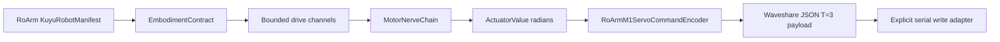

# RoArm M1 Hardware Probe

This note defines the first guarded real-hardware test path for Waveshare RoArm
M1. It is a Kuyu CLI adapter over the RoArm `KuyuRobotManifest`,
`EmbodimentContract`, and MotorNerve contracts; it is not a Kuyu simulation
task and does not move Manas control logic into Kuyu.

The hardware facts used here come from the Waveshare RoArm-M1 wiki and the
RoArm-M1 ROS2 serial communication node tutorial: five ST3215 serial bus servo
degrees of freedom, USB serial JSON control, `/dev/ttyUSB0` at 115200 baud, and
the `T=3` joint-position JSON payload with `P1...P5`, `S1...S5`, and `A1...A5`.

## Responsibility Boundary



| Layer | Responsibility | Reliability rule |
|---|---|---|
| `KuyuRobotManifest` | Selects the RoArm body and embodiment files used for the probe. | Manifest, body, actuator mounts, transmissions, and embodiment validation must pass before any command is generated. |
| `EmbodimentContract` | Declares five bounded joint drive and actuator channels. | Ranges, units, and MotorNerve stages are validated before hardware encoding. |
| `MotorNerveChain` | Maps bounded `DriveIntent` values to morphology-specific actuator radians. | Reflex and drive clamps are applied before hardware encoding. |
| `RoArmM1ServoCommandEncoder` | Converts four arm actuator radians plus the gripper clamp target to Waveshare JSON fields `P1...P5`, `S1...S5`, `A1...A5` using the same command directions and joint 2 reduction declared in the body model. | Invalid shape, non-finite values, unsafe arm/gripper targets, and invalid pulse ranges fail closed. |
| `HardwareCalibrationPlan` | Declares the reviewed sweep commands and required observations for parity identification. | Plan generation never moves hardware by itself. |
| `HardwareCalibrationReport` | Stores measured joint response and optional contact evidence. | `hardwareParity` remains rejected until measured samples cover every active joint within tolerance. |
| `probe-roarm-m1` | Loads the manifest, produces payloads, writes calibration plans, validates calibration reports, and optionally writes one USB serial command. | Serial output requires both `--enable-motion` and a non-empty `--device`. |

## Dry Run

Run from `unconscious/kuyu`:

```bash
swift run kuyu probe-roarm-m1
```

Expected neutral payload shape:

```json
{"A1":60,"A2":60,"A3":60,"A4":60,"A5":60,"P1":2047,"P2":2047,"P3":2047,"P4":2047,"P5":2047,"S1":0,"S2":0,"S3":0,"S4":0,"S5":0,"T":3}
```

## Hardware Write

Serial writes are disabled by default. Use a device path only after the arm is
mechanically clear, powered correctly, and reachable over the Waveshare USB
serial interface.

```bash
swift run kuyu probe-roarm-m1 --device /dev/cu.usbserial-0001 --enable-motion
```

For Linux hosts using the vendor default:

```bash
swift run kuyu probe-roarm-m1 --device /dev/ttyUSB0 --enable-motion
```

The embodiment now carries the manufacturer URDF joint ranges because it is the
shared Manas/Kuyu contract. The hardware probe still uses the conservative
safe-commissioning clamp by default. Full model limits require the explicit
`--use-model-limits` flag in addition to `--enable-motion`.

## Hardware Parity Calibration

Generate a reviewed sweep plan first. This does not write to the serial device:

```bash
swift run kuyu probe-roarm-m1 --write-calibration-plan /tmp/roarm-m1-hardware-plan.json
```

The plan contains safe arm/gripper targets, generated `T=3` payloads, pulse values,
and the required measurement fields. Execute only reviewed individual poses with
the existing guarded `--enable-motion` path, then store measured positions,
latency, voltage, temperature, and load observations in a
`HardwareCalibrationReport`.

Validate the measured report before claiming parity:

```bash
swift run kuyu probe-roarm-m1 --validate-calibration-report /tmp/roarm-m1-hardware-report.json
```

Validation requires every active joint to have measured samples, identified
latency/time constant/deadband/backlash/friction terms, and position error below
the strict Kuyu hardware-parity tolerance. A report with unmeasured placeholders
is rejected.
