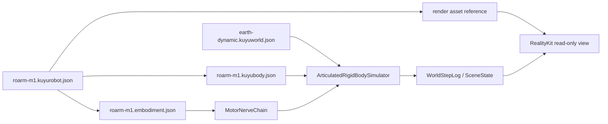

# RoArm M1 Simulation

RoArm M1 is the first Kuyu manipulator path that targets
`ReadinessLevel.dynamicSimulation`. The runtime uses native Kuyu body, world,
and embodiment contracts as authority. Render assets are optional visual inputs
and never define physics.

## Runtime Flow



| Boundary | Owner | Contract |
|---|---|---|
| Body | `KuyuBodyModel` | Declares manufacturer URDF links, STL visual/collision meshes, active revolute joints, passive mimic joints, supplemented inertial properties, hard/soft joint limits, servo output frames, transmission metadata, damping, and friction. |
| World | `KuyuWorldModel` | Declares gravity, fixed timestep, and the enabled physics capabilities for the run. |
| Control | `EmbodimentContract` | Declares bounded Manas signals, actuator ranges, latency budgets, and MotorNerve stages. |
| Plant | `ArticulatedRigidBodySimulator` | Integrates a deterministic fixed-base articulated rigid-body state with gravity, damping/friction, joint limits, and servo saturation. |
| Rendering | `SceneState` consumer | RealityKit reads logged poses and joint scalars; it does not mutate physics or load hidden physical values. |

## Readiness

| Level | RoArm M1 status | Reason |
|---|---|---|
| `visualPreview` | Pass | Render asset and link/joint graph are available for inspection. |
| `kinematicPreview` | Pass | Joint topology, ranges, and signal mapping are declared. |
| `dynamicSimulation` | Pass | Mass, inertia, hard/soft limits, damping/friction, gravity, timestep, servo output frames, transmission reduction, raw servo torque, and joint-side torque saturation are declared. |
| `contactTraining` | Expected fail | Contact-rich manipulation, friction calibration, and grasp tasks are not yet supported. |
| `hardwareParity` | Expected fail | Real-hardware calibration and parity evidence are outside this milestone. |

## Current Goal Status

| Goal | Status | Verification |
|---|---|---|
| Manufacturer body definition | Complete for URDF kinematic geometry | Tests parse the bundled Waveshare URDF and compare every native link, STL mesh reference, visual/collision origin, joint parent/child, joint origin, axis, velocity limit, hard/soft limit, and mimic relation directly against it. |
| Actuator and servo range consistency | Complete for declared joint ranges | Tests require active body joint limits, sensor ranges, drive ranges, actuator ranges, and `RoArmM1ServoCommandEncoder.manufacturerJointLimits` to match. |
| Dynamic movement inside joint ranges | Complete for smoke motion | The articulated simulator runs a deterministic smoke trajectory through `MotorNerveChain`, checks `motorNerveTrace`, and verifies drive intents, actuator values, plant joint scalars, and Waveshare `T:3` servo pulse encoding stay in range. |
| Manas manipulator controller | Smoke placeholder | No learned or task-level Manas controller is claimed yet. The dynamic path exercises the Manas/MotorNerve boundary with bounded drive targets until a manipulator controller is implemented. |
| Hardware parity / contact grasping | Not complete | These remain gated by measured calibration and contact/friction evidence. |

## RoArm M1 Source Mapping

| Source fact | Kuyu definition | Provenance |
|---|---|---|
| Link names, STL visual/collision meshes, joint origins, joint axes, active joint limits, and gripper mimic graph | `roarm-m1.kuyubody.json` and `urdf/roarm-m1.urdf` | Waveshare RoArm-M1 URDF Open Source Model |
| Base and arm dimensions | Packaged STL mesh coordinates and render URDF | Waveshare RoArm-M1 dimensions drawing and STEP model |
| Five ST3215 serial bus servos, command directions, output frames, and big-arm 1:3 timing-pulley reduction | `roarm-m1.kuyubody.json` actuator mounts/attachments and `roarm-m1.embodiment.json` actuator dynamics | Waveshare RoArm-M1 wiki, RoArm-M1 ROS2 serial tutorial, and ST3215 Servo wiki |
| Mass, inertia, damping, friction, stiction, backlash | Explicit supplemented Kuyu values | Not present in the manufacturer URDF; scoped to `dynamicSimulation` only |

## Running In Kuyu UI

1. Open the Simulation configuration.
2. Press `Use RoArm M1`.
3. Press `Run`.

The run emits active joint state in `plantState.scalars` as both the Manas
channels `joint_1` through `joint_5` and the manufacturer joint IDs
`base_to_L1`, `L1_to_L2`, `L2_to_L3`, `L3_to_L4`, and `L4_to_L5_1_A`.
RealityKit applies those values from `SceneState` for visual inspection only.

## Standalone Visual Check

Use the simulator preview executable when the task is only to inspect the moving
RoArm M1 dynamic simulation:

```bash
swift run kuyu-simulator-preview
```

This window loads the bundled RoArm M1 robot manifest, enables the URDF/STL
render asset, runs the articulated dynamic simulator, and replays the resulting
joint state through RealityKit. The simulator itself runs faster than wall time;
after the run completes, this preview loops the recorded timeline so the
articulated motion remains visible. Use pinch/magnification to zoom and drag to
orbit the camera. The older `kuyu-model-preview` executable is intentionally
static and is only for checking the model geometry.
