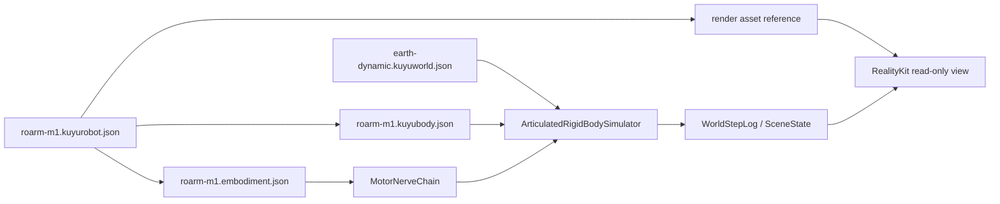

# RoArm M1 Simulation

RoArm M1 is the first Kuyu manipulator path that targets
`ReadinessLevel.dynamicSimulation`. The runtime uses native Kuyu body, world,
and embodiment contracts as authority. Render assets are optional visual inputs
and never define physics.

## Runtime Flow

| Boundary | Owner | Contract |
|---|---|---|
| Body | `KuyuBodyModel` | Declares fixed-base links, revolute joints, inertial properties, joint limits, damping, friction, and servo actuator attachments. |
| World | `KuyuWorldModel` | Declares gravity, fixed timestep, and the enabled physics capabilities for the run. |
| Control | `EmbodimentContract` | Declares bounded Manas signals, actuator ranges, latency budgets, and MotorNerve stages. |
| Plant | `ArticulatedRigidBodySimulator` | Integrates a deterministic fixed-base articulated rigid-body state with gravity, damping/friction, joint limits, and servo saturation. |
| Rendering | `SceneState` consumer | RealityKit reads logged poses and joint scalars; it does not mutate physics or load hidden physical values. |

## Readiness

| Level | RoArm M1 status | Reason |
|---|---|---|
| `visualPreview` | Pass | Render asset and link/joint graph are available for inspection. |
| `kinematicPreview` | Pass | Joint topology, ranges, and signal mapping are declared. |
| `dynamicSimulation` | Pass | Mass, inertia, limits, damping/friction, gravity, timestep, and servo limits are declared. |
| `contactTraining` | Expected fail | Contact-rich manipulation, friction calibration, and grasp tasks are not yet supported. |
| `hardwareParity` | Expected fail | Real-hardware calibration and parity evidence are outside this milestone. |

## Running In Kuyu UI

1. Open the Simulation configuration.
2. Press `Use RoArm M1`.
3. Press `Run`.

The run emits joint state in `plantState.scalars` as `joint_1` through
`joint_5`. RealityKit applies those values from `SceneState` for visual
inspection only.
