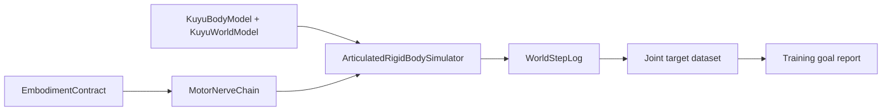

# RoArm M1 Training

RoArm M1 has no camera in the current Kuyu model, and contact-rich grasping is
not yet calibrated. The first training target is therefore proprioceptive joint
target tracking under `ReadinessLevel.dynamicSimulation`.

## Goal



| Field | Value |
|---|---|
| Goal ID | `roarm-m1-joint-target-tracking-v1` |
| Robot | `roarm-m1-v0` |
| Required readiness | `dynamicSimulation` |
| Project template execution | `designOnly` until a five-drive Manas joint-target policy backend exists |
| Observation | 25 proprioceptive channels: joint position, velocity, target error, lower-limit margin, upper-limit margin |
| Action | 5 bounded joint target drives |
| Completion gate | finite records, zero joint-limit violations, movement above smoke threshold, mean/max target error inside the smoke envelope |

This is a smoke training goal, not a claim that Manas already has a learned
manipulator controller or a compatible source model bundle. It produces a
reward-aware dataset and an explicit report that later Manas/MLX training can
consume.

## Efficiency Techniques

| Technique | Kuyu implementation target |
|---|---|
| Teacher trajectory bootstrap | Deterministic Kuyu trajectories are written as supervised joint target labels before policy-gradient work. |
| Hindsight goal relabeling | Achieved joint poses are duplicated as successful hold-goals with zero target-error channels. |
| Model-based warm start | Dataset records include `physicsState`, `actualState`, `actionValues`, `reward`, and `continueValue`. |
| Domain randomization | The project template declares randomized servo, mass, inertia, friction, damping, and latency ranges for the next stage. |
| Residual refinement | Later contact stages must keep the MotorNerve/teacher action as the base action and learn only residual corrections. |

## Command

```bash
swift run kuyu train-roarm-m1-joint-targets \
  --output /tmp/kuyu-roarm-m1-joint-target-training \
  --duration 2.0 \
  --seed 7
```

Expected artifacts:

| Path | Purpose |
|---|---|
| `/tmp/kuyu-roarm-m1-joint-target-training/roarm-m1-joint-target-training-report.json` | Goal status, metrics, and active efficiency techniques |
| `/tmp/kuyu-roarm-m1-joint-target-training/dataset/meta.json` | Dataset metadata, reward descriptor, observation provenance |
| `/tmp/kuyu-roarm-m1-joint-target-training/dataset/records.jsonl` | Source and hindsight-relabeled training records |

## Current Smoke Result

The first checked run used `duration=2.0` and `seed=7`.

| Metric | Value |
|---|---:|
| Status | `achieved` |
| Records | 240 |
| Source records | 120 |
| Hindsight records | 120 |
| Mean absolute target error | 0.545470 rad |
| Maximum absolute target error | 1.854167 rad |
| Movement magnitude | 0.975127 rad |
| Joint-limit violations | 0 |

The next meaningful training step is to connect this task profile to a Manas
joint-target policy backend. Contact, friction, grasping, and hardware parity
remain separate readiness gates.
