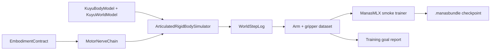

# RoArm M1 Training

RoArm M1 has no camera in the current Kuyu model, and contact-rich grasping is
not yet calibrated. The first training target is therefore proprioceptive arm
and gripper clamp target tracking under `ReadinessLevel.dynamicSimulation`.

## Goal



| Field | Value |
|---|---|
| Goal ID | `roarm-m1-arm-gripper-target-tracking-v1` |
| Robot | `roarm-m1-v0` |
| Required readiness | `dynamicSimulation` |
| Project template execution | `designOnly` for full campaign orchestration; CLI smoke Manas bundle training is implemented |
| Observation | 25 proprioceptive channels: arm/gripper position, velocity, target error, lower-limit margin, upper-limit margin |
| Action | 5 bounded target drives: 4 arm axes and 1 gripper clamp axis |
| Completion gate | finite records, zero joint-limit violations, movement above smoke threshold, mean/max target error inside the smoke envelope |

This is a smoke training goal, not a claim that contact grasping or hardware
parity is solved. It produces a reward-aware dataset, an explicit report, and a
Manas bundle whose runtime contract names the RoArm arm/gripper observation and
drive schemas.

## Efficiency Techniques

| Technique | Kuyu implementation target |
|---|---|
| Teacher trajectory bootstrap | Deterministic Kuyu trajectories are written as supervised arm/gripper target labels before policy-gradient work. |
| Hindsight goal relabeling | Achieved arm poses and gripper clamp states are duplicated as successful hold-goals with zero target-error channels. |
| Model-based warm start | Dataset records include `physicsState`, `actualState`, `actionValues`, `reward`, and `continueValue`. |
| Domain randomization | The project template declares randomized servo, mass, inertia, friction, damping, and latency ranges for the next stage. |
| Residual refinement | Later contact stages must keep the MotorNerve/teacher action as the base action and learn only residual corrections. |

## Command

```bash
swift run kuyu train-roarm-m1-arm-gripper \
  --output /tmp/kuyu-roarm-m1-arm-gripper-training \
  --duration 2.0 \
  --seed 7
```

Expected artifacts:

| Path | Purpose |
|---|---|
| `/tmp/kuyu-roarm-m1-arm-gripper-training/roarm-m1-arm-gripper-training-report.json` | Goal status, metrics, and active efficiency techniques |
| `/tmp/kuyu-roarm-m1-arm-gripper-training/dataset/meta.json` | Dataset metadata, reward descriptor, observation provenance |
| `/tmp/kuyu-roarm-m1-arm-gripper-training/dataset/records.jsonl` | Source and hindsight-relabeled training records |
| `/tmp/kuyu-roarm-m1-arm-gripper-training/manas/roarm-m1-arm-gripper.manasbundle` | ManasMLX smoke checkpoint with RoArm arm/gripper runtime contract |

## Current Smoke Result

The first checked run used `duration=2.0` and `seed=7`.

| Metric | Value |
|---|---:|
| Status | `achieved` |
| Records | 240 |
| Source records | 120 |
| Hindsight records | 120 |
| Mean absolute target error | 0.545470 rad |
| Maximum absolute target error | 1.854167 rad |
| Movement magnitude | 0.975127 rad |
| Joint-limit violations | 0 |

The next meaningful training step is measured hardware identification for
hardware parity and contact/grasp tasks. Contact, friction, grasping, and
hardware parity remain separate readiness gates.
