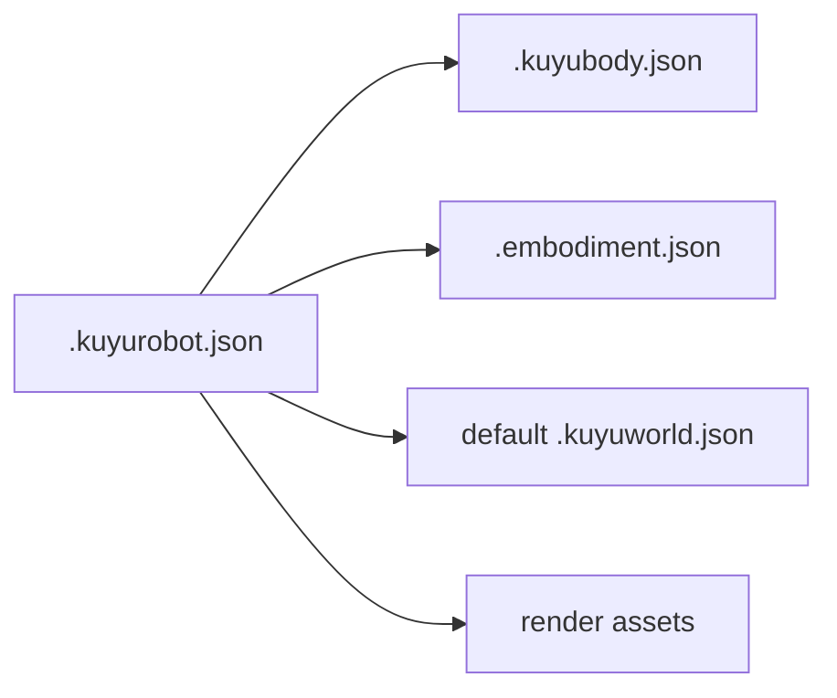

# Robot Manifest

`KuyuRobotManifest` is the loading entry point for a robot package. It is not a
physical model and does not contain control algorithms.

| Field | Responsibility |
|---|---|
| `robotID`, `name`, `category` | Identity and selection metadata. |
| `bodyModel` | Required reference to `KuyuBodyModel`. |
| `defaultWorldModel` | Optional default world for app/CLI runs. |
| `embodimentContract` | Required Manas/Kuyu control boundary. |
| `compatibilityReport` | Optional import/provenance report. |
| `renderAssets` | Read-only visualization assets. |

External URDF/Xacro and SDF files are adapters. The native JSON files are the
authority once imported.
