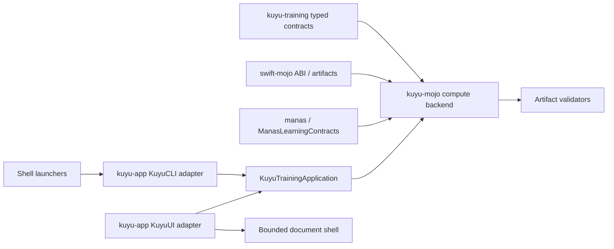
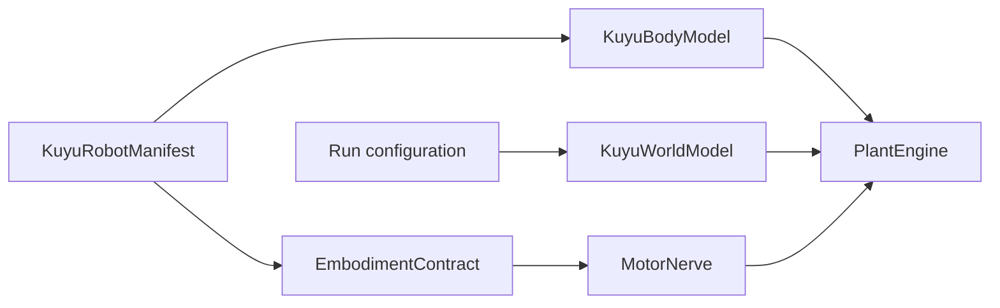

# Kuyu Specification

This document is the authoritative normative specification for Kuyu.

## Purpose (Normative)
Kuyu is a **learning simulator** for Manas. It is **not** a general-purpose
simulator; it exists to provide the environment, realism, and logs required
for portable Mojo-backed learning. It injects swappability events and HF
stressors while keeping runs reproducible.

Kuyu owns the training runtime boundary for Manas improvement. Generic
training contracts, rollout orchestration, artifacts, and validators live in
Kuyu packages. Concrete numerical execution lives in `kuyu-mojo` behind Kuyu
training protocols. The production graph contains no compatibility backend. If
a Mojo capability is unavailable, the corresponding Kuyu API MUST fail with a
typed result.

The cross-program compute decision is authoritative in
`../MOJO_COMPUTE_ARCHITECTURE.md`. Mojo 1.0.0 has satisfied the cutover gate, so
this is an active migration constraint rather than a future target.

## Responsibility Boundary (Normative)
Kuyu owns the training-world side of the unconscious stack:

- world simulation and deterministic physics execution,
- scenario definition, stress injection, and failure policy,
- RL environment contracts, reward functions, rollout harnesses, and rollout artifacts,
- dataset export and provenance metadata,
- visual inspection, CLI orchestration, and UI command routing.

Kuyu MUST NOT own or duplicate:

- Manas control protocol internals,
- Manas learning model internals,
- concrete optimizer or accelerator kernels outside the `kuyu-mojo` backend boundary,
- shared mutable model-store execution across parallel rollout workers.

The top-level Kuyu application may bridge to Manas/Mojo for execution and
training, but those bridges do not make Manas model internals a Kuyu core or
training-contract responsibility.

## API-First Application Boundary (Normative)
Kuyu APIs are the source of truth for training execution, scenario rollout,
learning campaign orchestration, checkpoint evaluation, checkpoint selection,
artifact writing, artifact validation, regression gates, readiness checks, and
continuation/resume selection. KuyuUI/Bounded and KuyuCLI are adapters over the
same typed Kuyu APIs and worker service; they are not independent execution
engines. Heavy Mojo training runs on the designated primary Mac training host
and MAY use authenticated attempt-owned child processes. A Jetson worker is a
deployment, inference/control, and HIL boundary; it MUST NOT be selected as an
implicit remote optimizer or training fallback. Every process boundary MUST
preserve the same acceptance, validation, and terminal-state semantics.

The package and target ownership skeleton is fixed in
`../KUYU_PACKAGE_ARCHITECTURE.md`. This Kuyu spec defines behavior; the package
architecture document defines where that behavior may live.

The end-to-end learning artifact, optimizer-input, trajectory, policy
distribution, promotion, and observability contracts are fixed in
`LEARNING_SYSTEM_SPEC.md`. Implementations MUST NOT define alternate contracts
in a backend, trainer, CLI, or UI target.

Required layering:



- `KuyuTraining` owns portable task profiles, rollout contracts, campaign
  lifecycle, checkpoint-evaluator contracts, regression and promotion gates,
  continuation resolution, artifact publication, project package contracts,
  and validation schemas.
- `manas` owns typed model/training identities, shapes, and session
  request/result contracts in `ManasLearningContracts`; it does not implement
  numerical learning code or read a persisted Kuyu dataset schema.
- The `kuyu-mojo` package owns Mojo bridge execution, compiled canonical-world
  programs, accelerator kernels, Manas adapter execution, device-resident
  rollout/autodiff/optimizer state, and concrete compute implementations
  consumed by the Kuyu training runtime. It does not own the lifecycle,
  acceptance, continuation, or publication semantics it executes.
- The `kuyu-app` package owns `KuyuTrainingApplication`, `KuyuCLI`, and `KuyuUI`
  adapters. They map
  command-line or UI intent into Kuyu API configuration, subscribe to Kuyu
  events, and report or render Kuyu artifacts. They MUST NOT implement separate
  checkpoint acceptance, readiness, continuation, or artifact validity logic.
- Bounded is a macOS shell over `KuyuUI`. It constructs the concrete learning
  executor and injects it through the backend-neutral application contract. It
  MUST NOT own learning algorithms or success/failure decisions.
- Worker launch MUST use a digest-verified immutable request, explicitly
  authorized roots, an exclusive active lease, a root-contained cooperative
  stop request, and a durable terminal summary. Reconnection MUST NOT trust PID
  identity alone.
- Before spawning, the launcher MUST materialize the source checkpoint as a
  read-only copy-on-write snapshot under the immutable launch directory and
  bind the launch request to that snapshot's verified digest.
- Before spawning, the launcher MUST stage the selected executable, or its
  containing application bundle, under the private immutable launch directory.
  The staged entrypoint MUST match the selected source by byte count and SHA-256
  digest so path replacement cannot change which worker executes.
- Worker control and artifacts MUST be bound to one attempt identity consisting
  of launch ID, attempt ID, and launch digest. Stop requests, progress snapshots,
  lease adoption, and terminal outcomes MUST NOT be accepted across attempts.
- Every worker progress event MUST be appended to an attempt-bound monotonic
  journal and synchronized durably. Reconnected observers MUST replay all unread
  complete records in order and reject identity or sequence discontinuities. A
  worker that cannot persist progress MUST cancel and terminate the training run;
  continuing an unobservable run is invalid.
- Progress observers MUST read journals incrementally from a retained byte
  cursor. They wait for a partial trailing record, fail closed on a malformed
  complete record, and revalidate attempt identity after replacement or
  truncation. UI refresh MUST NOT repeatedly load and decode the entire journal.
- Runtime progress uses a campaign -> scenario -> control-step hierarchy and
  preserves concurrently active siblings. Campaign and selected-scenario ETA,
  producer freshness, observer-receipt freshness, and artifact-load freshness
  remain distinct. Candidate acceptance reports through this same hierarchy as
  `candidateGate` work.
- A reconnected observer MUST have a finite cooperative-stop deadline. A dead
  worker without a valid attempt-bound outcome MUST produce a failed tombstone
  instead of remaining indefinitely active.
- A completed worker summary is successful only when it contains an accepted
  checkpoint. The worker MUST persist contradictory completion as a failed
  attempt before releasing its lease, and a supervising parent MUST reject any
  terminal summary whose disposition contradicts the child exit status.
- Shell scripts are launch/build wrappers only. They may select an Xcode-built
  binary and set environment values, but MUST NOT be the authority for learning
  success, checkpoint acceptance, or final artifact validity.
- Any capability exposed in the UI for training, evaluation, continuation, or
  checkpoint publication MUST be backed by the same Kuyu API path used by CLI.
  UI-only behavior must be explicitly limited to display, inspection, or debug
  controls.
- UI presentation state may cache progress and derived summaries, but the final
  state is the typed Kuyu artifact set validated by the corresponding Kuyu
  validator.

## Design Alignment
Kuyu preserves physical dynamics and morphology effects because the body/plant
is treated as a **computational resource** in Manas. Fidelity of the plant
model is therefore part of the learning contract.

## Engine Compatibility (View‑Only)
Kuyu may interoperate with common physics engines **only as view/verification
targets**. The simulation itself is always executed by Kuyu. Canonical physics
in `WORLD_SPEC.md` is the source of truth; external engines must consume Kuyu
state and must **not** drive or mutate the simulation.

Minimum requirements:
- Any engine adapter is **read‑only** (Kuyu → engine).
- “Shadow physics” is allowed for verification, but never authoritative.
- Apple platforms use **RealityKit** as the default render backend.

Notes:
- External engines consume `SceneState` and debug streams only.
- Deterministic replay is governed by Kuyu; external engine state is non‑authoritative.

## Core Principles
- Training‑first with **multiple morphologies**; quadcopter is a reference scenario, not exclusive.
- Same‑type swappability is a first‑class event.
- Reflex‑aware HF stress (impulse/vibration/glitch/latency spike).
- Bundle/Gating stress (salience and normalization shocks).

## Visual Inspection (Required)
Kuyu must provide a visual inspection UI comparable to a modern game‑engine
editor. The baseline renderer on Apple platforms is **RealityKit**, while
other engines (e.g., Unreal) are supported via **view‑only adapters**.
The operator must be able to confirm world state visually, not just via logs.

Minimum capabilities:
- 3D scene render of plant, sensors, and environment.
- Debug overlays for axes, forces/torques, and actuator values.
- Event timeline (swap/fault markers) with seed/time display.
- Scrub/pause/step controls for deterministic replay.
- Live inspection panels for sensor streams and Manas internals
  (Bundle/Gating/Trunks/DriveIntent/Reflex).

## Interface Boundary
- Inputs: sensor streams only (no ground truth).
- Outputs: DriveIntent (primitive activations) + Reflex corrections → MotorNerve → actuator values.
- M2+ observability output: descending snapshots, upward summaries, and arbitration traces for conscious/unconscious interop validation.

MotorNerve is the peripheral routing protocol. The **MotorNerveEndpoint**
maps DriveIntent + Reflex corrections to actuator values. Intermediate
MotorNerve stages may map MotorNerve signals to MotorNerve signals when a
multi-stage chain is required. MotorNerve is morphology-dependent and is not a
safety or decision module.

## Shared Contracts (Normative)
- Signal contract: `SIGNAL_CONTRACT.md`.
- Time contract: `TIME_CONTRACT.md`.
- Plant API: `PLANT_API.md`.

## Native Body/World/Embodiment Contracts (Normative)
Kuyu loads robots through a `KuyuRobotManifest` (`.kuyurobot.json`). The
manifest is an identity and reference envelope only. Physical structure,
simulation world, and the Manas control boundary are separate authoritative
contracts:



| Contract | Authority |
|---|---|
| `KuyuBodyModel` | Robot links, joints, mass, inertia, collision/visual geometry, actuator and sensor mounting. |
| `KuyuWorldModel` | Gravity, timestep, solver policy, materials, surfaces, and contact/friction declarations. |
| `EmbodimentContract` | Shared Kuyu/Manas signals, observations, actuators, latency budgets, and MotorNerve stages. |
| `CompatibilityReport` | Import provenance and readiness evidence for external format conversion. |

URDF and expanded Xacro are body import formats. SDF is a world import format.
They are adapters, not runtime authority. Kuyu MUST NOT load URDF/STL/RealityKit
assets as hidden physics sources.

If a non-empty manifest or world path is provided, manifest load, body load,
world load, embodiment load, compatibility validation, and readiness checks
MUST fail closed. They MUST NOT fall back to `ReferenceQuadrotorParameters`
baselines. Reference baselines are test fixtures only.

## World Engine (Baseline)
- Fixed Δt, multi‑rate as integer multiples.
- Generic plant dynamics with **profile-selectable plant models** (quadcopter is a reference model).
- Sensor emulation (IMU minimum for M1‑ATT; extensible for other plants).
- Actuator lag, saturation, asymmetry models.
- Disturbances: wind torque, impulses, vibration.

## Swappability & Stress Events
- Sensor swaps: gain/bias/noise/delay/bandwidth/dropout changes.
- Actuator swaps: max output, time constant, gain, deadzone shifts.
- HF stress: impulse torque, vibration, brief glitches, latency spikes.

## Metrics (External / Optional)
Evaluation metrics are not a Kuyu core responsibility in the current phase.
Kuyu guarantees **correct state evolution and logs**; metric computation is
performed by downstream training or analysis tools as needed.

## RL Environment Contract (M1.5, Normative)
Kuyu exposes a minimal RL environment contract so algorithms can be connected
without moving algorithm ownership into Kuyu.

Required semantics:
- Environments expose `reset(seed:scenario:)` and `step(action:)`.
- `reset(seed:scenario:)` returns the first formal observation consumed by a
  policy. Reset observations and step observations MUST use the same schema for
  the same scenario class.
- One `step(action:)` is one control decision, not one physics tick. The action
  selected from `O[k]` MUST be applied before physics advances, held for the
  configured control period, and returned with `O[k+1]` as one typed
  transition. Reward is the sum across the enclosed physics ticks.
- Failure checks run after every enclosed physics tick. A failure terminates the
  control period immediately, so the final failure transition MAY be shorter
  than the nominal control period and MUST retain its actual failure time.
- Reference environments require sensor sampling every physics tick and a
  MotorNerve period equal to the Cut control period. Unsupported schedules fail
  with typed errors at reset. A scenario horizon may end with a shorter final
  control transition.
- Lift and single-lift reference tasks use an 8-channel observation schema:
  channels 0...5 are IMU channels, channel 6 is altitude z, and channel 7 is
  vertical velocity z.
- The primary action path is `DriveIntent`; direct actuator actions are
  teacher/test escape hatches.
- `done` means failure or task terminal.
- `truncated` means time-limit or resource-limit terminal.
- rewards must be finite and include a `RewardDescriptor` with identity,
  version, and config hash.
- rollout artifacts must record scenario id, seed, policy id, robot manifest id,
  config hash, reward sum, terminal reason, failure metadata, worker count, and
  cancellation/limit state where applicable.
- each reinforcement rollout record must retain a unique policy decision ID,
  the exact action-source observation and time, the policy action, the applied
  actuator command, and the resulting observation. Post-action state MUST NOT be
  substituted for the policy input.

Parallel rollout is scenario/seed parallelism. Each worker MUST have an
independent environment and policy instance. Shared mutable model-store
execution is prohibited; workers consume immutable checkpoint snapshots and
own their Mojo sessions and device buffers.

Sensor stress applies to the formal observation contract. For the 8-channel
lift observation schema, state channels 6 and 7 are valid targets for
gain/bias/noise/dropout/latency/HF glitch modifiers unless a scenario explicitly
declares a narrower stress scope.

## Failure Definition (Normative)
Failure is **fail‑fast**: a scenario terminates on the first failure condition.
Each failure MUST record a `failureReason` and `failureTime`.

Failure conditions (minimum set):
- **Simulation integrity**: any NaN/Inf in plant state, sensor outputs, or commands.
- **Ground violation**: position.z < groundZ (default 0) at any time.
- **Sustained fall**: vertical velocity < -fallVelocityThreshold for ≥ fallDurationSeconds.
- **Safety envelope sustained**: tilt or |ω| exceeds the envelope for longer than the
  sustained‑violation threshold.

Failure is **not optional**. Training and evaluation MUST treat the failure point as terminal.

## Logs (Minimum)
Sensors, DriveIntent, Reflex outputs, actuator values,
attitude/omega traces, event schedule + seeds, and safety traces.

## Training Environment
See `TRAINING_SPEC.md` for training loop contracts, required suites, and
dataset/metric requirements for M1.

## Evolution Harness (M2, Normative)
Kuyu runs evolutionary optimization over Manas checkpoint candidates through a
typed training runtime. `kuyu-training` owns the generic population, scheduling,
rollout, gate, artifact, validation, and continuation contracts. `kuyu-mojo`
owns concrete Manas/Mojo mutation, crossover, batched inference, checkpoint
serialization, and accelerator execution.

Required artifacts:
- `evolution-contract.json`
- `evolution-manifest.json`
- `generations.jsonl`
- `candidates.jsonl`
- `fitness.jsonl`
- `elite-archive.json`
- `quality-diversity-archive.json`
- `lineage.json`

Required semantics:
- Candidate evaluation may run with bounded concurrency, recorded as
  `candidateEvaluationConcurrency` in the manifest.
- The manifest MUST record `searchStrategy`, `bootstrapSource`,
  `worldModelUsage`, `commonRandomSeed`, `antitheticSampling`,
  `mutationRate`, and `mutationNoiseScale`. These values are part of the
  harness contract, not hidden backend state.
- `genetic` is the default strategy. `antitheticEvolutionStrategy` enables
  paired positive/negative perturbation metadata with a common random seed.
  `qualityDiversity` requires a quality-diversity archive over typed behavior
  descriptors.
- Kuyu may adapt mutation rate and mutation noise scale from generation gate
  results. Accepted generations may decay exploration pressure; rejected
  generations may increase it within configured bounds. The concrete mutation
  implementation remains behind the Manas/Mojo variation backend.
- A run is accepted when at least one candidate has passed the quality gate.
  Later generation regressions MUST NOT discard an earlier accepted elite.
- Completed evolution artifacts MUST contain a non-empty elite archive, a
  best candidate id, and a finite best fitness.
- Quality-diversity cells MUST reference existing candidates and finite
  behavior descriptors. The archive is an observability and selection artifact;
  it does not make `kuyu-app` or Bounded the owner of optimizer internals.
- Rejected generations MUST include typed candidate-level rejection reasons.
- Gaussian mutation over Manas model bundles MUST preserve `model.json`,
  write `core.safetensors` and optional `reflex.safetensors`, emit the Manas
  `manas-bundle.json` model-bundle manifest when serializing a checkpoint, and
  produce a reloadable candidate checkpoint.
- Xcode runtime verification is required for the primary Apple Metal training
  path. Jetson deployment acceptance additionally requires native Linux ARM64
  accelerator execution, model inference, bounded control-loop behavior, and
  HIL evidence; one platform's successful build is not evidence for the other
  platform, and Jetson training throughput is not a learning gate.

Reference verification commands:

```bash
cd unconscious/kuyu
xcodebuild -scheme kuyu -destination 'platform=macOS' -derivedDataPath .xcode/DerivedData build
.xcode/DerivedData/Build/Products/Debug/kuyu evolve-manas --snapshot /path/to/checkpoint --variation gaussian --evaluation regression --population 1 --generations 1 --elite-count 1 --episodes 1 --suites 6
xcodebuild test -scheme kuyu-app-Package -destination 'platform=macOS' -maximum-test-execution-time-allowance 60
```

## World Physics Specification
Canonical physics + deterministic negligibility policy live in `WORLD_SPEC.md`.

## System/Profile Architecture (Gazebo-aligned)
Kuyu mirrors Gazebo’s separation of concerns: physics, sensors, rendering, and control
are treated as distinct systems. Determinism is enforced in physics + sensor systems;
rendering is allowed to be non-deterministic.

Required systems:
- PhysicsSystem (fixed Δt, deterministic integrator)
- SensorSystem (IMU6 minimum; noise/bias/delay models)
- ActuatorSystem (motor lag/saturation/asymmetry)
- EventSystem (swaps, HF stressors, latency spikes)

Optional systems:
- CommandSystem (UI and external control)

World → System order is fixed and versioned in `WORLD_SPEC.md`.

### RenderSystem (required)
- KuyuUI must use RenderSystem as a pure consumer of scene state.
- Rendering must never write to physics or sensor state.

### CommandSystem (required for KuyuUI)
- KuyuUI issues simulation run/export commands through CommandSystem only.
- KuyuUI issues learning, checkpoint evaluation, continuation, and validation
  commands through typed Kuyu runtime APIs only. UI and shell code must not own
  readiness, resume, acceptance, or regression policy.
- Commands enqueue into EventSystem / scheduler, never mutate physics directly.
- Training loop orchestration may live in a controller, but execution must cross
  the Kuyu API boundary defined above.
- User-visible KuyuUI operations MUST log `kuyu.ui` with `action`, `task`,
  `robotManifest`, and relevant controller/model identifiers. Manifest, body,
  world, embodiment, compatibility, and readiness errors MUST include `reason`
  and `error`.

## World Model Boundary (M1.6/M2)
M1.6 runtime source of truth is analytical Kuyu physics. `kuyu-world-model` is
verified separately and is not an authoritative execution path for M1.6.

World-model adapters may exist only behind the environment/rollout boundary.
When no adapter is selected, physics-only behavior MUST be numerically identical
to the analytical physics reference. M2 world-model execution must validate
imagined rollouts against physics replay before accepting rewards or terminal
state.

M2 world-model training uses causal rollout artifacts to build same-record
`O[k], U[k], O[k+1]` residual tuples, where `U[k]` is the actuator command
actually applied after MotorNerve. Policy-space action values are not a valid
substitute for `U[k]`. A trained `StateWorldModel` checkpoint is an auxiliary prediction model,
not a replacement for Kuyu physics. `imagine-train` MUST preflight and validate
the checkpoint before Manas imagination training can publish a new Core/Reflex
checkpoint. Missing checkpoints, missing config, NaN/Inf predictions,
uncertainty excess, terminal mismatch, or residual-threshold excess MUST fail
closed and MUST NOT fall back to baseline physics or publish the candidate
Manas checkpoint.
