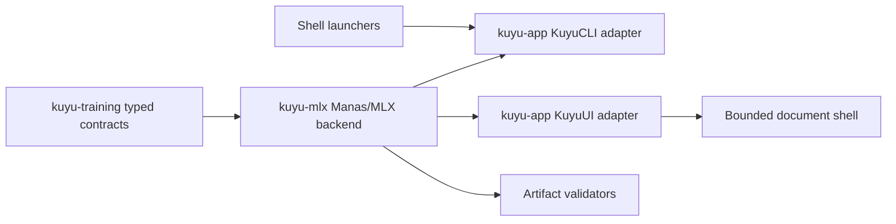

# Kuyu Specification

This document is the authoritative normative specification for Kuyu.

## Purpose (Normative)
Kuyu is a **learning simulator** for Manas. It is **not** a general‑purpose
simulator; it exists to provide the environment, realism, and logs required
for MLX‑based learning. It injects swappability events and HF stressors while
keeping runs reproducible.

Kuyu does **not** implement learning algorithms. MLX training happens outside
Kuyu; Kuyu provides closed‑loop execution, data, and evaluation.

## Responsibility Boundary (Normative)
Kuyu owns the training-world side of the unconscious stack:

- world simulation and deterministic physics execution,
- scenario definition, stress injection, and failure policy,
- RL environment contracts, reward functions, rollout harnesses, and rollout artifacts,
- dataset export and provenance metadata,
- visual inspection, CLI orchestration, and UI command routing.

Kuyu MUST NOT own or duplicate:

- Manas control protocol internals,
- Manas learning model internals,
- PPO, Dreamer, or other RL algorithm implementations,
- shared `ManasMLXModelStore` execution across parallel rollout workers.

The top-level Kuyu application may bridge to Manas/MLX for execution and
training smoke tests, but those bridges do not make Manas model internals a
Kuyu core responsibility.

## API-First Application Boundary (Normative)
Kuyu APIs are the source of truth for training execution, scenario rollout,
learning campaign orchestration, checkpoint evaluation, checkpoint selection,
artifact writing, artifact validation, regression gates, readiness checks, and
continuation/resume selection. KuyuUI/Bounded and KuyuCLI are adapters over the
same in-process Kuyu APIs; they are not independent execution engines.

The package and target ownership skeleton is fixed in
`../KUYU_PACKAGE_ARCHITECTURE.md`. This Kuyu spec defines behavior; the package
architecture document defines where that behavior may live.

Required layering:



- `KuyuTraining` owns portable task profiles, rollout contracts, evaluation
  artifacts, project package contracts, and validation schemas.
- The `kuyu-mlx` package owns Manas/MLX bridge execution, campaign runners,
  checkpoint evaluators, regression gates, continuation resolution, and artifact
  publication.
- The `kuyu-app` package owns `KuyuCLI` and `KuyuUI` adapters. They map
  command-line or UI intent into Kuyu API configuration, subscribe to Kuyu
  events, and report or render Kuyu artifacts. They MUST NOT implement separate
  checkpoint acceptance, readiness, continuation, or artifact validity logic.
- Bounded is a macOS document shell over `KuyuUI`. It MUST NOT own learning
  execution or success/failure decisions.
- Shell scripts are launch/build wrappers only. They may select an Xcode-built
  binary and set environment values, but MUST NOT be the authority for learning
  success, checkpoint acceptance, or final artifact validity.
- Any capability exposed in the UI for training, evaluation, continuation, or
  checkpoint publication MUST be backed by the same Kuyu API path used by CLI.
  UI-only behavior must be explicitly limited to display, inspection, or debug
  controls.
- UI presentation state may cache progress and derived summaries, but the final
  state is the typed Kuyu artifact set validated by the corresponding Kuyu
  validator.

## Design Alignment
Kuyu preserves physical dynamics and morphology effects because the body/plant
is treated as a **computational resource** in Manas. Fidelity of the plant
model is therefore part of the learning contract.

## Engine Compatibility (View‑Only)
Kuyu may interoperate with common physics engines **only as view/verification
targets**. The simulation itself is always executed by Kuyu. Canonical physics
in `WORLD_SPEC.md` is the source of truth; external engines must consume Kuyu
state and must **not** drive or mutate the simulation.

Minimum requirements:
- Any engine adapter is **read‑only** (Kuyu → engine).
- “Shadow physics” is allowed for verification, but never authoritative.
- Apple platforms use **RealityKit** as the default render backend.

Notes:
- External engines consume `SceneState` and debug streams only.
- Deterministic replay is governed by Kuyu; external engine state is non‑authoritative.

## Core Principles
- Training‑first with **multiple morphologies**; quadcopter is a reference scenario, not exclusive.
- Same‑type swappability is a first‑class event.
- Reflex‑aware HF stress (impulse/vibration/glitch/latency spike).
- Bundle/Gating stress (salience and normalization shocks).

## Visual Inspection (Required)
Kuyu must provide a visual inspection UI comparable to a modern game‑engine
editor. The baseline renderer on Apple platforms is **RealityKit**, while
other engines (e.g., Unreal) are supported via **view‑only adapters**.
The operator must be able to confirm world state visually, not just via logs.

Minimum capabilities:
- 3D scene render of plant, sensors, and environment.
- Debug overlays for axes, forces/torques, and actuator values.
- Event timeline (swap/fault markers) with seed/time display.
- Scrub/pause/step controls for deterministic replay.
- Live inspection panels for sensor streams and Manas internals
  (Bundle/Gating/Trunks/DriveIntent/Reflex).

## Interface Boundary
- Inputs: sensor streams only (no ground truth).
- Outputs: DriveIntent (primitive activations) + Reflex corrections → MotorNerve → actuator values.
- M2+ observability output: descending snapshots, upward summaries, and arbitration traces for conscious/unconscious interop validation.

MotorNerve is the peripheral routing protocol. The **MotorNerveEndpoint**
maps DriveIntent + Reflex corrections to actuator values. Intermediate
MotorNerve stages may map MotorNerve signals to MotorNerve signals when a
multi-stage chain is required. MotorNerve is morphology-dependent and is not a
safety or decision module.

## Shared Contracts (Normative)
- Signal contract: `SIGNAL_CONTRACT.md`.
- Time contract: `TIME_CONTRACT.md`.
- Plant API: `PLANT_API.md`.

## Robot Descriptor (Normative)
Kuyu loads robots via `RobotDescriptor` (JSON). The descriptor is the canonical
entry point and MUST reference the physics model (URDF) rather than loading
URDF directly. This keeps signals, MotorNerve mapping, and plant parameters coherent.

If a non-empty descriptor path is provided, descriptor load, inertial load, and
parameter resolution failures MUST fail closed. They MUST NOT fall back to
`ReferenceQuadrotorParameters.baseline`. Empty descriptor paths may use the
reference baseline only as a fixture/reference smoke path.

## World Engine (Baseline)
- Fixed Δt, multi‑rate as integer multiples.
- Generic plant dynamics with **profile-selectable plant models** (quadcopter is a reference model).
- Sensor emulation (IMU minimum for M1‑ATT; extensible for other plants).
- Actuator lag, saturation, asymmetry models.
- Disturbances: wind torque, impulses, vibration.

## Swappability & Stress Events
- Sensor swaps: gain/bias/noise/delay/bandwidth/dropout changes.
- Actuator swaps: max output, time constant, gain, deadzone shifts.
- HF stress: impulse torque, vibration, brief glitches, latency spikes.

## Metrics (External / Optional)
Evaluation metrics are not a Kuyu core responsibility in the current phase.
Kuyu guarantees **correct state evolution and logs**; metric computation is
performed by downstream training or analysis tools as needed.

## RL Environment Contract (M1.5, Normative)
Kuyu exposes a minimal RL environment contract so algorithms can be connected
without moving algorithm ownership into Kuyu.

Required semantics:
- Environments expose `reset(seed:scenario:)` and `step(action:)`.
- `reset(seed:scenario:)` returns the first formal observation consumed by a
  policy. Reset observations and step observations MUST use the same schema for
  the same scenario class.
- Lift and single-lift reference tasks use an 8-channel observation schema:
  channels 0...5 are IMU channels, channel 6 is altitude z, and channel 7 is
  vertical velocity z.
- The primary action path is `DriveIntent`; direct actuator actions are
  teacher/test escape hatches.
- `done` means failure or task terminal.
- `truncated` means time-limit or resource-limit terminal.
- rewards must be finite and include a `RewardDescriptor` with identity,
  version, and config hash.
- rollout artifacts must record scenario id, seed, policy id, descriptor id,
  config hash, reward sum, terminal reason, failure metadata, worker count, and
  cancellation/limit state where applicable.

Parallel rollout is scenario/seed parallelism. Each worker MUST have an
independent environment and policy instance. Shared `ManasMLXModelStore`
execution is out of scope until M2 worker snapshots or actor pools exist.

Sensor stress applies to the formal observation contract. For the 8-channel
lift observation schema, state channels 6 and 7 are valid targets for
gain/bias/noise/dropout/latency/HF glitch modifiers unless a scenario explicitly
declares a narrower stress scope.

## Failure Definition (Normative)
Failure is **fail‑fast**: a scenario terminates on the first failure condition.
Each failure MUST record a `failureReason` and `failureTime`.

Failure conditions (minimum set):
- **Simulation integrity**: any NaN/Inf in plant state, sensor outputs, or commands.
- **Ground violation**: position.z < groundZ (default 0) at any time.
- **Sustained fall**: vertical velocity < -fallVelocityThreshold for ≥ fallDurationSeconds.
- **Safety envelope sustained**: tilt or |ω| exceeds the envelope for longer than the
  sustained‑violation threshold.

Failure is **not optional**. Training and evaluation MUST treat the failure point as terminal.

## Logs (Minimum)
Sensors, DriveIntent, Reflex outputs, actuator values,
attitude/omega traces, event schedule + seeds, and safety traces.

## Training Environment
See `TRAINING_SPEC.md` for training loop contracts, required suites, and
dataset/metric requirements for M1.

## Evolution Harness (M2, Normative)
Kuyu may run evolutionary optimization over Manas checkpoint candidates, but
Kuyu still does not own the optimizer implementation. Kuyu owns candidate
scheduling, rollout evaluation, task-quality gates, artifact validation, and
checkpoint accept/reject decisions. Manas/MLX owns model weights, mutation and
training backend details, and checkpoint serialization.

Required artifacts:
- `evolution-contract.json`
- `evolution-manifest.json`
- `generations.jsonl`
- `candidates.jsonl`
- `fitness.jsonl`
- `elite-archive.json`
- `quality-diversity-archive.json`
- `lineage.json`

Required semantics:
- Candidate evaluation may run with bounded concurrency, recorded as
  `candidateEvaluationConcurrency` in the manifest.
- The manifest MUST record `searchStrategy`, `bootstrapSource`,
  `worldModelUsage`, `commonRandomSeed`, `antitheticSampling`,
  `mutationRate`, and `mutationNoiseScale`. These values are part of the
  harness contract, not hidden backend state.
- `genetic` is the default strategy. `antitheticEvolutionStrategy` enables
  paired positive/negative perturbation metadata with a common random seed.
  `qualityDiversity` requires a quality-diversity archive over typed behavior
  descriptors.
- Kuyu may adapt mutation rate and mutation noise scale from generation gate
  results. Accepted generations may decay exploration pressure; rejected
  generations may increase it within configured bounds. The concrete mutation
  implementation remains behind the Manas/MLX variation backend.
- A run is accepted when at least one candidate has passed the quality gate.
  Later generation regressions MUST NOT discard an earlier accepted elite.
- Completed evolution artifacts MUST contain a non-empty elite archive, a
  best candidate id, and a finite best fitness.
- Quality-diversity cells MUST reference existing candidates and finite
  behavior descriptors. The archive is an observability and selection artifact;
  it does not make Kuyu the owner of PPO, Dreamer, CMA-ES, or other optimizer
  internals.
- Rejected generations MUST include typed candidate-level rejection reasons.
- Gaussian mutation over ManasMLX checkpoints MUST preserve `model.json`,
  write `core.safetensors` and optional `reflex.safetensors`, emit the Manas
  `manas-bundle.json` model-bundle manifest when serializing a checkpoint, and
  produce a reloadable candidate checkpoint.
- Xcode runtime verification is required for MLX save/load smoke coverage
  because SwiftPM command-line execution may not exercise the same Metal
  resource path.

Reference verification commands:

```bash
cd unconscious/kuyu
swift run kuyu evolve-manas --snapshot /path/to/checkpoint --variation gaussian --evaluation regression --population 1 --generations 1 --elite-count 1 --episodes 1 --suites 6
xcodebuild test -scheme kuyu-Package -destination 'platform=macOS' -maximum-test-execution-time-allowance 120
```

## World Physics Specification
Canonical physics + deterministic negligibility policy live in `WORLD_SPEC.md`.

## System/Profile Architecture (Gazebo-aligned)
Kuyu mirrors Gazebo’s separation of concerns: physics, sensors, rendering, and control
are treated as distinct systems. Determinism is enforced in physics + sensor systems;
rendering is allowed to be non-deterministic.

Required systems:
- PhysicsSystem (fixed Δt, deterministic integrator)
- SensorSystem (IMU6 minimum; noise/bias/delay models)
- ActuatorSystem (motor lag/saturation/asymmetry)
- EventSystem (swaps, HF stressors, latency spikes)

Optional systems:
- CommandSystem (UI and external control)

World → System order is fixed and versioned in `WORLD_SPEC.md`.

### RenderSystem (required)
- KuyuUI must use RenderSystem as a pure consumer of scene state.
- Rendering must never write to physics or sensor state.

### CommandSystem (required for KuyuUI)
- KuyuUI issues simulation run/export commands through CommandSystem only.
- KuyuUI issues learning, checkpoint evaluation, continuation, and validation
  commands through typed Kuyu runtime APIs only. UI and shell code must not own
  readiness, resume, acceptance, or regression policy.
- Commands enqueue into EventSystem / scheduler, never mutate physics directly.
- Training loop orchestration may live in a controller, but execution must cross
  the Kuyu API boundary defined above.
- User-visible KuyuUI operations MUST log `kuyu.ui` with `action`, `task`,
  `modelDescriptor`, and relevant controller/model identifiers. Descriptor
  load/preflight errors MUST include `reason` and `error`.

## World Model Boundary (M1.6/M2)
M1.6 runtime source of truth is analytical Kuyu physics. `kuyu-world-model` is
verified separately and is not an authoritative execution path for M1.6.

World-model adapters may exist only behind the environment/rollout boundary.
When no adapter is selected, physics-only behavior MUST be numerically identical
to the analytical physics reference. M2 world-model execution must validate
imagined rollouts against physics replay before accepting rewards or terminal
state.

M2 world-model training uses rollout artifacts to build residual training
tuples. A trained `StateWorldModel` checkpoint is an auxiliary prediction model,
not a replacement for Kuyu physics. `imagine-train` MUST preflight and validate
the checkpoint before Manas imagination training can publish a new Core/Reflex
checkpoint. Missing checkpoints, missing config, NaN/Inf predictions,
uncertainty excess, terminal mismatch, or residual-threshold excess MUST fail
closed and MUST NOT fall back to baseline physics or publish the candidate
Manas checkpoint.
