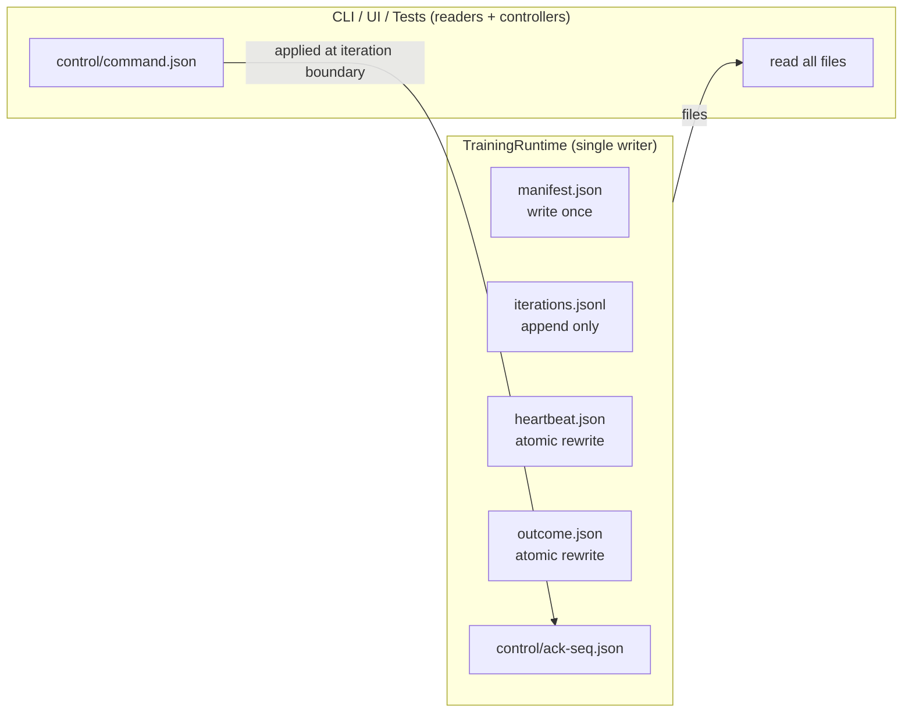
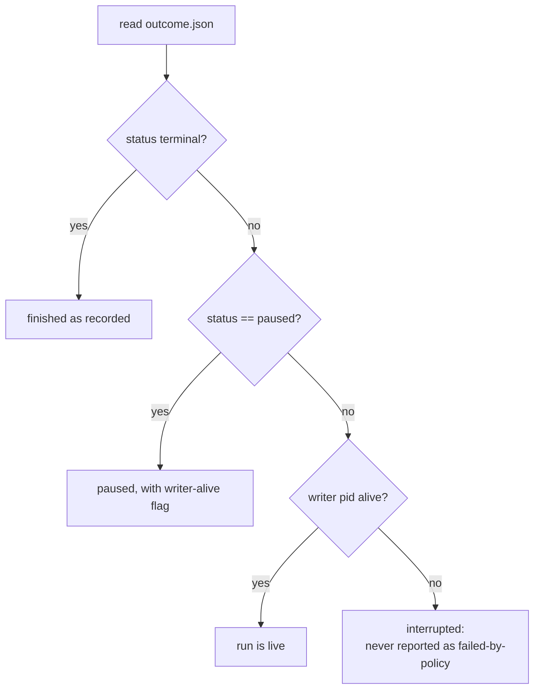

# Training Run Contract

## Purpose

Define the normative on-disk contract for every Kuyu training run. A training
run is a product-level object: it can be launched, observed, paused, resumed,
replayed, and audited by independent clients (CLI, UI, tests) without sharing
process memory. This contract is the single source of truth for run identity,
run evidence, run liveness, and run control.

This document is normative for all new training execution paths. Backward
compatibility with the legacy `/tmp` log files and ad-hoc print streams is
explicitly **not** a goal; legacy paths are to be removed, not bridged.

## Design Goals

| Goal | Consequence |
|---|---|
| One run = one directory | Everything needed to understand a run lives under a single path |
| Evidence is append-only | Per-iteration records are journaled, never overwritten |
| Crash-legible | A dead run is distinguishable from a live run from disk alone |
| Determinism-stamped | Every run records the exact seeds and code identity needed for Tier-0 replay |
| Client-neutral | CLI, UI, and tests read the same files; no client-private side channels |
| No silent fallback | Readers report corruption explicitly; writers fail loudly |

## Directory Layout

The run root defaults to `~/.kuyu/runs`. The environment variable
`KUYU_RUN_ROOT` overrides it (absolute path required). Runs are durable
evidence and MUST NOT be placed under `/tmp` or any cache directory.

```
<runRoot>/
└── <runID>/
    ├── manifest.json        # immutable identity, written once at creation
    ├── iterations.jsonl     # append-only iteration journal
    ├── heartbeat.json       # liveness, atomically rewritten by the trainer
    ├── outcome.json         # lifecycle status, rewritten on transitions
    └── control/
        ├── command.json     # pending control command (written by clients)
        └── ack-<seq>.json   # acknowledgment per applied command
```



## Run Identity

- `runID` is a `TrainingRunID` (existing KuyuTraining type). New runs use the
  format `<task>-<UTC yyyyMMdd-HHmmss>-<4 random base36 chars>`, e.g.
  `attitude-20260612-093015-k4qz`. The format is a convention, not a parser
  contract: readers MUST treat `runID` as opaque.
- The run directory name equals `runID.rawValue`.
- Creating a run whose directory already exists is an error
  (`duplicateRunDirectory`). Writers MUST NOT reuse or repair an existing
  directory.

## File Contracts

### manifest.json — immutable identity

Written exactly once, atomically, before the first iteration. Never modified
afterwards. Captures everything needed to interpret and reproduce the run.
Readers verify that `manifest.runID` matches the directory name and that
`schemaVersion` is supported; either mismatch fails closed.

Run creation atomically establishes the full skeleton: the run directory
(lock acquisition), `manifest.json`, an empty `iterations.jsonl`, an initial
`outcome.json` with `status == running`, and the `control/` directory.

| Field | Type | Meaning |
|---|---|---|
| `schemaVersion` | Int | Contract schema version (current: 2) |
| `runID` | String | Run identity |
| `createdAt` | ISO-8601 date | Creation time (UTC) |
| `task` | String | Task identifier (e.g. `attitude-rr-ppo`) |
| `profile` | String | Training profile identifier |
| `semanticVersion` | String | Semantic version of the training pipeline (e.g. `ppoRunVersion`) |
| `cacheKey` | String? | Optional cache key the run participates in |
| `code` | CodeIdentity | `gitHead`, `gitDirty`, `buildConfiguration` |
| `determinism` | DeterminismStamp | `mlxGlobalSeed`, `noiseSeedSalt`, `tier` |
| `host` | HostIdentity | `hostName`, `osVersion`, `processIdentifier` |
| `launch` | LaunchRecord | `executablePath`, `arguments`, `environmentOverrides` |

Determinism rules:

- `mlxGlobalSeed` is mandatory. A run that does not seed the global MLX RNG
  cannot claim Tier-0 and MUST record `tier` ≥ 1.
- RR-PPO records its base rollout exploration seed as `noiseSeedSalt`.
  Iteration and horizon seeds are derived from that value by the profile owner
  and are persisted in evaluation scopes; an unrelated placeholder salt is not
  valid determinism evidence.
- `environmentOverrides` records only the allow-listed `KUYU_*` /
  `MANAS_*` variables that influence training; it never captures the full
  environment (no secrets).

### iterations.jsonl — append-only journal

One JSON object per line. Each line is a `TrainingRunIterationRecord`,
serialized compact (single line, no pretty-printing), appended with a single
`write(2)` call ending in `\n`. The journal is the run's evidence stream; it
is never truncated or rewritten.

Per-record content (all optional groups may be omitted when not applicable):

| Group | Fields |
|---|---|
| Identity | `iteration` (Int, 0-based, strictly increasing), `recordedAt` |
| Horizon state | `supportHorizon`, `frontierHorizon`, `fullHorizon`, `mode` |
| Candidate decision | `accepted` (Bool), `materiallyImproved` (Bool), `rejectionReasons` ([String]), `progressSignals` ([String]), `progressRejectionReasons` ([String]), and aggregate/per-horizon health metrics for the retained policy |
| Evaluation | metric name → Double map, `evaluationHorizon`, and typed run-relative artifact references `{kind, path}` |
| Failure episodes | array of `{scenario, seed, terminalStep, reason}` |
| Phase timings | phase name → seconds map |
| Environment sample | optional small map of sampled DR parameters |
| Constraint state | optional `{metricID, observedCost, costLimit, constraintGap, dualLambda, episodeCount, transitionCount}` committed by constrained training |
| Checkpoint | optional `{path, sha256Digest}` of any checkpoint written this iteration |

Writer rules:

- Records MUST be appended in iteration order with no gaps; a resumed run
  continues from the last journaled iteration + 1.
- A record line MUST be a single line of UTF-8 JSON terminated by `\n`.
- The writer MUST NOT buffer multiple iterations before flushing.
- A constraint state MUST identify its aggregation metric. `observedCost` and
  `costLimit` without the same `metricID` are not comparable evidence.
- `accepted` means the candidate may be retained locally. It does not imply
  `materiallyImproved`; learning-stage promotion requires independent material
  progress evidence from the profile owner.
- Evaluation artifact paths MUST be relative to the run directory and reload
  through the artifact owner. Absolute paths, parent traversal, missing files,
  duplicate kinds, and duplicate paths fail closed.

Reader rules:

- Unknown fields MUST be ignored (forward compatibility).
- A torn tail — any bytes after the last record-terminating `\n`, typically
  left by an interrupted writer — is reported as `truncatedTailBytes` in the
  read result; never silently dropped, never an exception by itself.
- Invalid JSON in any newline-terminated line is genuine corruption and MUST
  throw (an interrupted single-write append can only tear the unterminated
  tail, never a terminated line).

### Reference attitude RR-PPO owner contract

The reference attitude profile uses a stricter profile-owned contract above the
generic journal:

| Boundary | Required evidence |
|---|---|
| Training scope | Every horizon is a typed scope with its own role, exploration seed, scenario set, and Kuyu dataset paths. Paths are not flattened across horizons. |
| Dataset identity | Kuyu owner validation binds every dataset to its scenario, embodiment SHA-256, and source checkpoint SHA-256. |
| Scenario split | Training and held-out scenario sets are disjoint and remain identical across all iterations of one run. |
| Held-out evaluation | The evaluator writes one owner artifact containing every candidate × horizon × scenario result. The iteration artifact stores its path and SHA-256. |
| Aggregate metrics | Stage reload reconstructs each horizon aggregate from the scenario results and rejects missing, duplicate, substituted, or rewritten results. |
| Retention | A candidate is retained only when it is accepted, materially improved, and its actor-only parameter digest differs from the source. A later safe but non-improving candidate cannot replace an earlier qualified checkpoint. |
| Terminal outcome | A staged run's `acceptedCheckpointPath` is exactly the stage's retained checkpoint and must reload successfully. |

The actor-only digest is computed directly from the `actor.*` safetensors byte
ranges. Digest verification does not load unrelated tensors into MLX. Training
and evaluation that do use MLX execute through `ManasMLXExecutionActor`, so two
campaigns cannot concurrently mutate process-global MLX execution state.

### heartbeat.json — liveness

Atomically rewritten by the trainer at least once per iteration and at least
every `heartbeatInterval` seconds (default 30) during long phases.

| Field | Type | Meaning |
|---|---|---|
| `updatedAt` | ISO-8601 date | Last write time |
| `iteration` | Int | Latest started iteration |
| `phase` | String | Current phase identifier (e.g. `rollout`, `update`, `evaluation`) |
| `processIdentifier` | Int32 | Writer PID |

Liveness decision procedure for readers:



The writer pid comes from the heartbeat when present, otherwise from the
manifest host identity (legal before the first heartbeat).

### outcome.json — lifecycle status

Atomically rewritten on every lifecycle transition. Contains:

| Field | Type | Meaning |
|---|---|---|
| `status` | TrainingRunLifecycleStatus | `running`, `completed`, `failed`, `cancelled`, `paused` |
| `updatedAt` | ISO-8601 date | Transition time |
| `finalIteration` | Int? | Last completed iteration |
| `failureReason` | String? | Mandatory when `status == failed` |
| `acceptedCheckpointPath` | String? | Final accepted checkpoint, when any |

Truncation is **not** a stored status: it is the derived condition
`status == running && writer pid dead`. Storing it would race with the dying
process; deriving it cannot.

### control/ — cooperative control plane

Clients request control by atomically writing `control/command.json`:

| Field | Type | Meaning |
|---|---|---|
| `sequence` | Int | Monotonically increasing per run |
| `command` | String | `pause`, `resume`, `stop`, `checkpoint` |
| `requestedAt` | ISO-8601 date | Request time |
| `requestedBy` | String | Client identifier |

Semantics:

- The trainer polls `command.json` at iteration boundaries only. Commands
  never preempt a running iteration (Tier-0 safety: no mid-iteration state
  mutation).
- On applying a command the trainer atomically writes
  `control/ack-<sequence>.json`
  (`{sequence, command, appliedAt, iteration, rejected, reason}`)
  and deletes `command.json`.
- A pending command is never overwritten: submitting while one is pending is
  an explicit error (`pendingControlCommandExists`).
- `sequence` must advance past the highest sequence visible on disk
  (acknowledged or pending); otherwise `staleControlSequence`.
- An unknown command value is acked with `rejected: true` and a mandatory
  reason; it is never silently ignored.
- `stop` produces `outcome.status == cancelled` with `finalIteration` set.

## Atomicity Rules

| File | Write discipline |
|---|---|
| `manifest.json` | temp sibling + rename (write once) |
| `iterations.jsonl` | append-only, one `write` per record, `\n`-terminated |
| `heartbeat.json` | `Data.write(options: [.atomic])` |
| `outcome.json` | `Data.write(options: [.atomic])` |
| `control/command.json` | `Data.write(options: [.atomic])` by clients |
| `control/ack-*.json` | `Data.write(options: [.atomic])` by trainer |

JSON encoding for non-journal files uses `[.prettyPrinted, .sortedKeys]` with
ISO-8601 dates (matches existing KuyuTraining artifact conventions). The
journal uses `[.sortedKeys]` only (compact single-line).

## Single-Writer Rule

Exactly one process may write a run directory. The writer creates the
directory itself (atomic `mkdir` semantics) — creation success **is** the
lock acquisition. Resume requires the previous writer to be terminally
recorded or provably dead (heartbeat PID check, falling back to the manifest
PID before the first heartbeat); a resume that detects a live foreign PID
MUST fail with `runStillLive`. The current process may always reattach to
its own run.

Resume over a torn journal tail is blocked (`tornJournalTail`) unless tail
repair is explicitly requested, in which case exactly the torn bytes are
trimmed and the repaired byte count is reported on the writer — recovery is
explicit at the call site, never silent.

## Registry Semantics

A registry client lists `<runRoot>` directories that contain a parseable
`manifest.json`. Directories without one are reported as `unreadable`
entries with the underlying error — they are never silently skipped. Sort
order is `createdAt` descending.

## Error Taxonomy

All contract violations are typed errors (`TrainingRunContractError`):

- `invalidRunRoot(path, reason)`
- `duplicateRunDirectory(path)`
- `missingFile(name, runID)`
- `corruptedFile(name, runID, reason)`
- `corruptedJournalLine(lineNumber, runID, reason)`
- `tornJournalTail(byteCount, runID)`
- `nonMonotonicIteration(expected, found)`
- `invalidManifest(reason)`
- `unsupportedSchemaVersion(found, supported)`
- `invalidOutcome(reason)`
- `pendingControlCommandExists(sequence)`
- `staleControlSequence(latest, found)`
- `invalidControlRecord(reason)`
- `runStillLive(processIdentifier)`
- `writeFailed(path, reason)`

No reader or writer may degrade any of these into a default value.

## Migration

Legacy outputs (`/tmp/curr.out`, overwritten flat metric files, print-only
iteration logs) are superseded. New training paths MUST write this contract
and MUST NOT dual-write legacy files. Existing analysis scripts move to the
journal; there is no compatibility shim.

## Ownership

- Contract types and stores live in `kuyu-training` (`KuyuTraining`), which
  is MLX-free: UI, CLI, and tests can read runs without Metal.
- Training executors (e.g. KuyuMLX RR-PPO) depend on `KuyuTraining` to write
  the contract; the contract package never depends on MLX.

Reference implementation
(`kuyu-training/Sources/KuyuTrainingRuntime/RunContract/`):

| Role | Type |
|---|---|
| Layout + root resolution | `TrainingRunContractSchema` |
| Identity | `TrainingRunManifest` (+ `CodeIdentity` / `DeterminismStamp` / `HostIdentity` / `LaunchRecord`) |
| Evidence | `TrainingRunIterationRecord`, `TrainingRunJournalReadResult` |
| Liveness | `TrainingRunHeartbeat`, `TrainingRunLiveness` |
| Lifecycle | `TrainingRunLifecycleStatus`, `TrainingRunOutcome` |
| Control | `TrainingRunControlAction`, `TrainingRunControlCommand`, `TrainingRunControlAcknowledgment` |
| Writer (trainer) | `TrainingRunArchiveWriter` |
| Reader (clients) | `TrainingRunArchiveReader` |
| Registry | `TrainingRunArchiveRegistry`, `TrainingRunRegistryEntry` |
| Errors | `TrainingRunContractError` |

## Authority

This document refines `kuyu/SPEC.md` and `kuyu/TRAINING_SPEC.md` for run
execution evidence. Where older documents describe `/tmp`-based logging,
this contract supersedes them.
